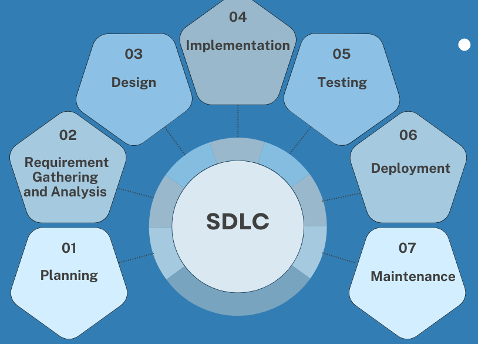

# Unit I: Introduction to Software Project Management (High-Yield Summary)

## 1. Fundamentals of SPM

### 1.1 Defining Software Projects

- **Unique features**:

  - Intangible products (software is not physical).
  - High changeability (requirements evolve).
  - Invisible progress (hard to measure directly).
  - Human-intensive and knowledge-driven.

### 1.2 **Triple Constraint (Iron Triangle)**:

The triple constraint triangle of project management is the visualisation of a triangle, with sides formed by time, scope, and cost. These three factors are the constraints that project managers juggle to keep a project running as expected.

- **Scope** (features, functionality) : The scope of the work refers to the project's deliverables or the result. It should be clearly defined and monitored throughout the project before beginning work. **Scope creep**, or the project getting bigger or changing without proper protocol, can throw the constraint triangle off balance.

- **Time** (schedule, deadlines) : Time is how long the project will take. It’s important for project managers to make sure the team finishes the project before a deadline. A project manager must figure out how long a project will take and ensure enough people working on the job to complete it in time.

- **Cost** (budget, resources) : The cost is the budget of the project. Clients and project managers agree on a budget before beginning the project, and keeping a project on budget will be one measure of success.

!!! warning "Note"

    _Changing any one of the three will impact the others._

!!! tip "Some Resolutions for PM[^1]"

    The following offers some everyday ways a project manager might adjust to keep the project on track.

    1. **Over budget**:

           When a project goes over budget, it means spending more money than the client agreed. Since budget is the cost constraint, something else (scope or time) must change.

           - If you reduce the scope (**Shifting Scope**), you deliver fewer features or smaller work, which also saves time and cost.
           - Another option is to cut down the time needed by using fewer people or tools. In this case, the scope stays the same, but time and cost are adjusted.

     2. **Scope creep**:

           Scope creep happens when the work expected in a project keeps increasing without following proper procedures (like formal change requests) i.e., when the expected deliverables grow larger and larger as the project progresses without following proper procedures, such as making change requests.

           When the scope expands, a project manager can adjust time and cost to compensate.

           If the scope expands, the project manager may:

           - Ask for more budget (to add people, tools, or resources) to finish on time.

           - Or, if extra funding is not available, the project may need a longer schedule

      3. **Over schedule** :

           If a project runs behind schedule, the project manager has two main options (might shift costs or scope to finish the project on time):

           - Increase costs: hire more workers or buy better tools to speed things up.

           - Reduce scope: negotiate with the client to cut down the amount of work.

!!! example "Triple constraints of project management"

    **Construction deadline**

      A construction company is building a new office complex for a client. The client requested to move into the building a month earlier than originally scheduled. The project manager might accommodate this request by increasing the budget and bringing in a larger crew to finish the project faster. Or, they might prioritise certain areas of the building to finish early so the client can move in while construction continues, which would be an example of rearranging the scope to fit the new requirements.

      Solution Summary:

      - Option 1: Increase budget → hire a larger crew to finish faster.
      - Option 2: Adjust scope → complete only the most important areas first so the client can move in early.

     **Marketing scope creep**

      A marketing team is preparing a package of marketing materials for a client ahead of a new product launch. The client requests five additional pages of material. The client doesn’t want to push back the product launch, so the time constraint has to remain the same. The project manager and the client will have to agree to either increase the budget and use more labour hours and resources or they will have to remove other materials to make room for the new additions.

      Solution Summary:

      - Option 1: Increase budget → hire more workers to complete everything.

      - Option 2: Adjust scope → remove some content to make room for the new additions.

!!! tip "How to manage the triple constraint"

    Use the following three tips to use the triple constraint triangle as a tool for success:

    1. ***Understand non-negotiables:*** Some constraints will be more flexible than others, depending on the project and client. Find out which constraint (time, cost, or scope) is most important to the client. Example: if scope and time cannot change, budget must adjust.

    2. ***Be aware of other factors:*** Sometimes quality is also a key constraint in addition to scope, time, and cost. Be flexible and use a more adapted model of project constraints for whatever your project needs are.

    3. ***Communicate with stakeholders:*** Keep stakeholders updated, set expectations, and get agreement before making changes.

### 1.3 **Software Development Lifecycle (SDLC)**:

#### 1. Planning

- Define the project goals, scope, purpose, and feasibility.
- Identify resources, budget, and risks.
- Create a high-level project plan.

#### 2. Requirement Analysis

- Gather and analyze functional and non-functional requirements.
- Document user needs and business requirements.
- Create a Software Requirement Specification (SRS) document.

#### 3. System Design

- Transform requirements into a blueprint for the system.
- Design system architecture, database, user interfaces, and data flow.
- Prepare design documents (HLD & LLD).

#### 4. Implementation (Coding)

- Developers write the actual code based on the design documents.
- Follow coding standards and best practices.
- Use version control systems to manage source code.

#### 5. Testing

- Verify and validate the software against requirements.
- Perform unit testing, integration testing, system testing, and acceptance testing.
- Identify and fix bugs.

#### 6. Deployment

- Release the software into the production environment.
- May involve a staged rollout (pilot, beta release) or full deployment.
- Ensure proper configuration and installation.

#### 7. Maintenance

- Provide ongoing support, bug fixes, and performance improvements.
- Handle user feedback and evolving requirements.
- Deliver patches, updates, and enhancements.
