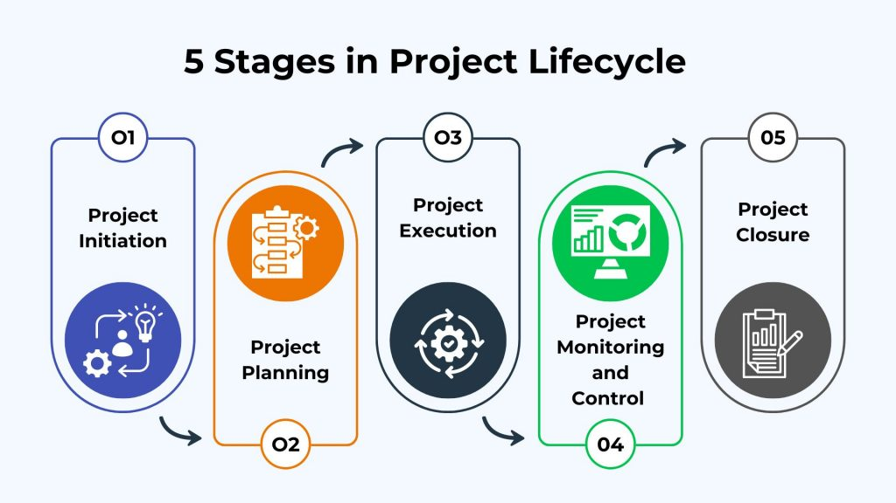
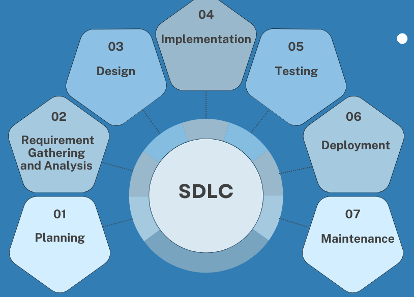

# 1.1 Fundamentals of software project management

## 1.1.1 Defination of software project

> A software project is a **temporary endeavor** undertaken to create a **_ unique software product, service, or result._** It is temporary because it has a **_defined beginning and end_**, and unique because it is not a routine operation but a specific set of operations designed to accomplish a singular goal.

A software project is a specific type of project where the primary deliverable is a software product, application, or service, or the enhancement of an existing one. This includes associated documentation, data, and processes required to conceive, design, implement, deploy, and sustain the software.

### 1.1.1.2 Unique features of software projects

Unlike construction or manufacturing projects, software projects have distinct characteristics:

1. **Intangibility:** The primary product—software—is not a physical entity. It is a logical construct. This makes it difficult to visualize progress, measure quantity, and assess quality through direct inspection. Progress is measured through completed features, passing tests, and demonstrated functionality.

2. **Complexity and Abstract Nature:** Software systems are among the most complex artifacts ever created. They involve intricate logical structures and interdependencies. A small change in one module can have unforeseen consequences in another, a phenomenon known as "tight coupling."

3. **High Volatility and Malleability:** Requirements are highly susceptible to change. This is due to evolving business needs, market shifts, user feedback, and technological advancements. Unlike a building's blueprint, a software's specification is often a living document. This makes scope creep a constant threat.

4. **Invisibility of Progress:** In construction, progress is visible (foundation poured, frame erected). In software, progress is not linearly correlated with time or effort spent. A team may spend a week seemingly without "visible" output while solving a critical architectural problem, then deliver multiple features rapidly afterward.

5. **Dependence on Human Ingenuity:** Software development is a highly creative and intellectual activity. The productivity and quality of the output are directly tied to the skill, experience, and collaboration of the project team. This makes Project Resource Management critical.

6. **Absence of "Wear and Tear":** Software does not degrade physically over time. However, it suffers from "software decay" or "technical debt"—its structure erodes as changes are made, making it harder to maintain and extend over time. Managing technical debt is a key project activity.

7. **Non-Linear Production Costs:** The cost of reproducing software is negligible. The vast majority of costs are in the initial development (the first copy). This contrasts with manufacturing, where each unit has a significant production cost.

8. **Ease of Replication & Low Reproduction Cost:** Once developed, the cost of replicating the software is negligible, shifting the focus from production cost to development cost and intellectual property.

### 1.1.1.3 The triple constraint: scope, time, and cost

The Triple Constraint, also known as the Project Management Triangle or Iron Triangle, is a fundamental model that states that every project is constrained by three primary, interconnected dimensions: Scope, Time, and Cost. The quality of the project is often seen as the central outcome, governed by the balance of these three constraints.

In modern project management, this model is often expanded to include other factors like Quality, Risk, and Resources, but the core triangle remains a powerful conceptual tool .

<!-- reference linked refence  -->
<figure markdown="span">
    {width="60%"}
    <figcaption>Project Management Triangle or Iron Triangle </figcaption>
    
<i>Image Source: <a href="https://asana.com/resources/project-management-triangle"> Asana  </a ></i>
 
</figure>

- **Scope** (features, functionality) : The scope of the work refers to the sum of all products, services, and results to be provided i.e., the project's deliverables or the result. It should be clearly defined and monitored throughout the project before beginning work. **Scope creep**, or the project getting bigger or changing without proper protocol, can throw the constraint triangle off balance.

- **Time** (schedule, deadlines) : The scheduled completion date for the project, broken down into the timelines for individual activities and milestones i.e., how long the project will take. It’s important for project managers to make sure the team finishes the project before a deadline. A project manager must figure out how long a project will take and ensure enough people working on the job to complete it in time.

- **Cost** (budget, resources) : The cost is the budget of the project. Clients and project managers agree on a budget before beginning the project, and keeping a project on budget will be one measure of success.

The Interdependent Relationship:

The core principle is that any change in one constraint will necessitate an adjustment in at least one of the others to maintain project quality and success.

- If Scope Increases (More Features): → Time and/or Cost must increase to maintain the same level of quality. If they are fixed, Quality will suffer.

- If Time is Reduced (Earlier Deadline): → Either Scope must be reduced or Cost must be increased (e.g., more developers working overtime) to maintain quality.

- If Cost is Reduced (Smaller Budget): → Either Scope must be reduced or Time must be increased, otherwise Quality will be compromised.

!!! warning "Application in Software Projects"

    A project manager's key role is to manage these trade-offs explicitly. For example, when a stakeholder requests a new feature (scope increase), the project manager must formally assess the impact on the schedule and budget through a Change Control Process and communicate the options: "We can add this feature, but it will delay the release by two weeks, or require an additional funding in budget."

!!! tip "Some Resolutions for PM"

    The following offers some everyday ways a project manager might adjust to keep the project on track.

    1. **Over budget**:

           When a project goes over budget, it means spending more money than the client agreed. Since budget is the cost constraint, something else (scope or time) must change.

           - If you reduce the scope (**Shifting Scope**), you deliver fewer features or smaller work, which also saves time and cost.
           - Another option is to cut down the time needed by using fewer people or tools. In this case, the scope stays the same, but time and cost are adjusted.

     2. **Scope creep**:

           Scope creep happens when the work expected in a project keeps increasing without following proper procedures (like formal change requests) i.e., when the expected deliverables grow larger and larger as the project progresses without following proper procedures, such as making change requests.

           When the scope expands, a project manager can adjust time and cost to compensate.

           If the scope expands, the project manager may:

           - Ask for more budget (to add people, tools, or resources) to finish on time.

           - Or, if extra funding is not available, the project may need a longer schedule

      3. **Over schedule** :

           If a project runs behind schedule, the project manager has two main options (might shift costs or scope to finish the project on time):

           - Increase costs: hire more workers or buy better tools to speed things up.

           - Reduce scope: negotiate with the client to cut down the amount of work.

!!! example "Triple constraints of project management"

    **Construction deadline**

      A construction company is building a new office complex for a client. The client requested to move into the building a month earlier than originally scheduled. The project manager might accommodate this request by increasing the budget and bringing in a larger crew to finish the project faster. Or, they might prioritise certain areas of the building to finish early so the client can move in while construction continues, which would be an example of rearranging the scope to fit the new requirements.

      Solution Summary:

      - Option 1: Increase budget → hire a larger crew to finish faster.
      - Option 2: Adjust scope → complete only the most important areas first so the client can move in early.

     **Marketing scope creep**

      A marketing team is preparing a package of marketing materials for a client ahead of a new product launch. The client requests five additional pages of material. The client doesn’t want to push back the product launch, so the time constraint has to remain the same. The project manager and the client will have to agree to either increase the budget and use more labour hours and resources or they will have to remove other materials to make room for the new additions.

      Solution Summary:

      - Option 1: Increase budget → hire more workers to complete everything.

      - Option 2: Adjust scope → remove some content to make room for the new additions.

!!! tip "How to manage the triple constraint"

    Use the following three tips to use the triple constraint triangle as a tool for success:

    1. ***Understand non-negotiables:*** Some constraints will be more flexible than others, depending on the project and client. Find out which constraint (time, cost, or scope) is most important to the client. Example: if scope and time cannot change, budget must adjust.

    2. ***Be aware of other factors:*** Sometimes quality is also a key constraint in addition to scope, time, and cost. Be flexible and use a more adapted model of project constraints for whatever your project needs are.

    3. ***Communicate with stakeholders:*** Keep stakeholders updated, set expectations, and get agreement before making changes.

### 1.1.1.4 Project lifecycle phases

A project lifecycle is the series of phases that a project passes through from its initiation to its closure. The structure of the lifecycle allows for control over the project and aligns technical work with management decision-making.

While specific lifecycle models vary (e.g., Predictive/Waterfall, Iterative, Incremental, Agile, Hybrid), they generally map to the following high-level, generic phases, which also correspond to the PMBOK Process Groups.These correspond to the five PMBOK Process Groups: Initiating, Planning, Executing, Monitoring & Controlling, and Closing.

<!-- reference linked refence  -->
<figure markdown="span">
    {width="60%"}
    <figcaption>Five PMBOK Process Groups (High level Generic phase) </figcaption>
    
<i>Image Source: <a href="https://www.invensislearning.com/blog/5-phases-project-management-lifecycle/"> Invensis Learning  </a ></i>
 
</figure>

1.  **Initiation:** The project is defined at a high level and authorized.
    - **_Key Activities_**: Developing the Project Charter (formal document authorizing the project), identifying key stakeholders, conducting a feasibility study, defining high-level objectives and scope.
    - _Outcome_: A signed project charter, giving the project manager the authority to apply organizational resources to project activities.
2.  **Planning:** Establish the total scope of the effort, define and refine the objectives, and develop the course of action required to attain those objectives.

    - **_Activities:_**

          - Project Management Plan(The overarching document).
          - Scope Baseline: (Scope Statement, WBS, WBS Dictionary).
          - Schedule Baseline: (Project Schedule, often a Gantt chart).
          - Cost Baseline: (Project Budget).
          - Plans for Risk, Quality, Resources, Communications, and Stakeholder Engagement.

    - _Outcome_: A comprehensive project management plan that will guide project execution and control.

3.  **Execution:** Complete the work defined in the project management plan to satisfy the project specifications.

    - _Activities:_ Coordinating people and resources, managing stakeholder engagement, conducting quality assurance activities, and building the deliverables. This is where the majority of the project's budget is spent.
    - In Software Terms: This is the phase where coding, unit testing, and integration testing primarily occur.
    - _Outcome:_ The completed software product deliverables.

4.  **Monitoring & Controlling (often concurrent):** Track, review, and regulate the progress and performance of the project; identify any areas in which changes to the plan are required; and initiate the corresponding changes.
    - _Activities:_ Coding, testing, team management, monitoring KPIs, managing changes. This phase runs concurrently with the Execution phase. It involves measuring project performance against the baselines using tools like Earned Value Management (EVM), controlling scope through a Change Control Board (CCB), managing risks, and controlling quality (e.g., testing).
    - _Output_: Performance reports, change requests, and updates to the project plan.
5.  **Closure:** The project is formally closed.
    - _Activities:_ Obtaining formal acceptance of the final product from the customer, conducting post-mortem or lessons learned sessions, archiving project records, releasing project resources, and closing all procurements.
    - In Software Terms: This includes final deployment to production, knowledge transfer to the operations or maintenance team, and system documentation handover.
    - Outcome: Formal project closure, archived documents, and lessons learned repository updates.

### 1.1.1.5 Software Develpoment Life cycle

A Software Development Life Cycle (SDLC) is a specific process for creating software applications. It defines the technical stages a software product goes through from conception to retirement and provides a structured, predictable process for building high-quality software.

<!-- reference linked refence  -->
<figure markdown="span">
    {width="80%"}
    <figcaption>Software Development life cycle</figcaption>
</figure>

#### 1. Planning

- Define the project goals, scope, purpose, and feasibility.
- Identify resources, budget, and risks.
- Create a high-level project plan.

#### 2. Requirement Analysis

- Gather and analyze functional and non-functional requirements.
- Document user needs and business requirements.
- Create a Software Requirement Specification (SRS) document.

#### 3. System Design

- Transform requirements into a blueprint for the system.
- Design system architecture, database, user interfaces, and data flow.
- Prepare design documents (HLD & LLD).

#### 4. Implementation (Coding)

- Developers write the actual code based on the design documents.
- Follow coding standards and best practices.
- Use version control systems to manage source code.

#### 5. Testing

- Verify and validate the software against requirements.
- Perform unit testing, integration testing, system testing, and acceptance testing.
- Identify and fix bugs.

#### 6. Deployment

- Release the software into the production environment.
- May involve a staged rollout (pilot, beta release) or full deployment.
- Ensure proper configuration and installation.

#### 7. Maintenance

- Provide ongoing support, bug fixes, and performance improvements.
- Handle user feedback and evolving requirements.
- Deliver patches, updates, and enhancements.

## 1.1.2 The role of project management in software engineering

Project management is the disciplined application of knowledge, skills, tools, and techniques to project activities to meet project requirements. In the complex and often volatile domain of software engineering, it serves as the essential framework that translates a business need or creative idea into a functional, high-quality software product.

### 1.1.2.1 Importance of project management in software development

1. Effective project management is critical in software development due to the field's inherent challenges, such as rapidly changing requirements, technological complexity, and high stakeholder expectations. Its importance is multifaceted:

2. Mitigating High Failure Rates: The Standish Group's CHAOS Report historically highlights that a significant percentage of software projects fail due to budget overruns, missed deadlines, and lack of required functionality. Project management provides the structure to combat this through proper planning, risk management, and control.

3. Managing Complexity: Modern software systems are complex. Project Management breaks down this complexity into manageable components (Work Breakdown Structure - WBS), tasks, and timelines.

4. Ensuring Predictability and Control: It establishes baselines for scope, schedule, and cost. By tracking against these baselines (Earned Value Management - EVM), a project manager can forecast outcomes and take corrective action.

5. Facilitating Communication: It establishes clear communication channels and plans, ensuring that stakeholders, developers, and users are aligned, which is a cornerstone of success as per the PMBOK Guide.

6. Optimizing Resource Utilization: It ensures that human resources (developers, testers, designers) and physical resources (servers, software licenses) are used efficiently and effectively.

7. Managing Quality: It moves quality from an afterthought (testing at the end) to an integral part of the process, ensuring the software is fit for its intended use and meets defined quality standards (e.g., ISO 25010).

8. Enabling Adaptability: While providing structure, modern project management frameworks (like Agile and Hybrid approaches) are designed to accommodate change, allowing teams to respond to feedback and evolving market needs without derailing the entire project.

### 1.1.2.2 Key responsibilities of a software project manager

The Software Project Manager (SPM) is the linchpin holding the project together. Their responsibilities span the entire project lifecycle and align closely with the PMBOK Process Groups (Initiating, Planning, Executing, Monitoring & Controlling, Closing).

1. Scope Management: Defining and controlling what is and is not included in the project. This involves creating a Work Breakdown Structure (WBS) to decompose project deliverables into smaller, more manageable components.

2. Schedule Management: Developing the project schedule, sequencing activities, estimating resources and durations, and tracking progress to ensure timely completion. Key tools include Gantt Charts, Critical Path Method (CPM), and Agile Sprints.

3. Cost Management: Estimating, budgeting, and controlling costs so the project is completed within the approved budget. Techniques include Analogous Estimating, Parametric Estimating, and Earned Value Management (EVM).

4. Quality Management: Ensuring the project will satisfy the needs for which it was undertaken. This includes quality planning, quality assurance (process-focused), and quality control (deliverable-focused, e.g., code reviews, testing).

5. Resource Management: Identifying, acquiring, and managing the team and physical resources needed. This involves team development, conflict resolution, and motivation, often guided by Tuckman's Ladder (Forming, Storming, Norming, Performing, Adjourning).

6. Communication Management: Creating, distributing, storing, and disposing of project information. A Communication Management Plan is vital to ensure the right information reaches the right stakeholders at the right time.

7. Risk Management: Conducting risk identification, analysis (qualitative and quantitative), response planning, and monitoring. For software projects, risks often involve technical feasibility, requirements volatility, and resource unavailability.

8. Stakeholder Management: Identifying all people or organizations affected by the project, analyzing their expectations and influence, and developing strategies to engage them effectively.

9. Integration Management: The overarching responsibility that knits all other areas together. It involves making trade-off decisions between competing objectives and ensuring the project's components are properly coordinated.

10. Procurement Management: Acquiring or procuring products, services, or results from outside the project team, such as third-party APIs, cloud services, or contractor support.

11. The project manager **plans and guides** the software project

    - The project manager is responsible for **identifying the users and stakeholders** and **determining their needs**

    - The project manager **coordinates the team**, ensuring that each task has an appropriate software engineer assigned and that each engineer has sufficient knowledge to perform it
    - To do this well, **the project manager must be familiar with every aspect of software engineering**

12. The project manager **drives the scope of the project**

    - The project manager should identify and talk to the main stakeholder
    - The effective way to show stakeholders that their needs are understood and that those specific needs will be addressed is with a vision and scope document

### 1.1.2.3 Balancing technical and managerial aspects

A Software Project Manager must operate at the intersection of technology and business. This balance is delicate and crucial for success.

The Managerial Focus: Involves leadership, communication, budgeting, scheduling, reporting, and stakeholder management. It's about the "what" and "why."

The Technical Understanding: Involves comprehending the software development lifecycle (SDLC), architecture, design patterns, coding practices, testing pyramids, and deployment pipelines (CI/CD). It's about the "how."

Why Balance is Critical:

Credibility with the Team: A manager with technical acumen can earn the respect of the development team, understand their challenges, and make realistic estimates and commitments. They can speak the team's language.

Informed Decision-Making: When technical challenges arise (e.g., a library is deprecated, a scaling issue is identified), a manager with technical knowledge can better assess the impact on scope, cost, and schedule.

Effective Risk Management: Many software project risks are technical (e.g., technology selection, integration complexity). Understanding these risks allows for proactive mitigation.

Bridge between Stakeholders: The SPM must translate business requirements from non-technical stakeholders into actionable items for the technical team and, conversely, explain technical constraints and progress in business terms.

Avoiding Micro-management: A strong technical understanding allows the SPM to trust the team's expertise on implementation details while focusing on managing the project's overall constraints and objectives.

The role is not to be the chief architect or lead developer but to be a facilitator who understands the technical landscape sufficiently to manage the project effectively.

## 1.1.3 Project management knowledge areas

As defined by the Project Management Institute's (PMI) PMBOK Guide (A Guide to the Project Management Body of Knowledge), Knowledge Areas are specialized areas of project management defined by their knowledge requirements and described in terms of their processes, practices, inputs, outputs, tools, and techniques.

### 1.1.3.1 Overview of the 10 PMBOK knowledge areas

The ten Knowledge Areas provide a structured framework for grouping project management processes.

1. Project Integration Management: The core coordinating function. It includes processes to identify, define, combine, unify, and coordinate the various processes and project management activities. Key Process: Develop Project Charter, Direct and Manage Project Work, Perform Integrated Change Control.

2. Project Scope Management: Ensures the project includes all the work required, and only the work required, to complete the project successfully. Key Process: Collect Requirements, Define Scope, Create WBS, Validate Scope.

3. Project Schedule Management: Manages the timely completion of the project. Key Process: Define Activities, Sequence Activities, Estimate Activity Durations, Develop Schedule, Control Schedule.

4. Project Cost Management: Involves planning, estimating, budgeting, financing, funding, managing, and controlling costs. Key Process: Estimate Costs, Determine Budget, Control Costs.

5. Project Quality Management: Determines quality policies, objectives, and responsibilities to ensure the project satisfies the needs for which it was undertaken. Key Process: Plan Quality Management, Manage Quality, Control Quality.

6. Project Resource Management: Identifies, acquires, and manages the resources needed for the successful completion of the project. Key Process: Estimate Activity Resources, Acquire Resources, Develop Team, Manage Team.

7. Project Communications Management: Ensures timely and appropriate planning, collection, creation, distribution, storage, retrieval, management, control, monitoring, and ultimate disposition of project information. Key Process: Plan Communications Management, Manage Communications, Monitor Communications.

8. Project Risk Management: Conducts risk management planning, identification, analysis, response planning, and implementation, and monitors risks. Key Process: Identify Risks, Perform Qualitative/Quantitative Risk Analysis, Plan Risk Responses, Implement Risk Responses.

9. Project Procurement Management: Involves the purchase or acquisition of products, services, or results needed from outside the project team. Key Process: Plan Procurement Management, Conduct Procurements, Control Procurements.

10. Project Stakeholder Management: Identifies the people, groups, or organizations that could impact or be impacted by the project, analyzes their expectations and influence, and develops strategies for engaging them. Key Process: Identify Stakeholders, Plan Stakeholder Engagement, Manage Stakeholder Engagement, Monitor Stakeholder Engagement.

### 1.1.3.2 Applying knowledge areas to software projects

The PMBOK framework is generic; its application to software projects requires contextualization.

Scope Management: In Agile, the scope is managed through a Prioritized Product Backlog. The fixed-time/-budget nature of sprints requires rigorous scope negotiation within each iteration. The WBS may be represented as user stories and tasks.

Schedule Management: Instead of a single, monolithic Gantt chart, schedules are often iterative. Release Plans outline high-level timelines, while Sprint Burndown Charts track progress within short cycles.

Cost Management: Costs are heavily weighted toward human resources. Estimation techniques like Story Points and Planning Poker are used for relative sizing, which feeds into velocity-based forecasting.

Quality Management: Quality is "built-in" through practices like Test-Driven Development (TDD), Continuous Integration (CI), and Automated Testing. "Shift-Left" testing is a key principle, integrating quality checks early in the lifecycle.

Risk Management: Software projects face unique risks like technical debt, security vulnerabilities, and integration challenges with legacy systems. Risk registers are living documents reviewed in daily stand-ups and sprint retrospectives.

Stakeholder Management: Key stakeholders often include Product Owners, end-users, operations teams (DevOps), and marketing. Engagement is continuous through Sprint Reviews and Demo.

### 1.1.3.3 Integrating knowledge areas in project management

The Knowledge Areas are not silos; they are deeply interconnected and often overlapping. A change in one area will almost always affect others. Integration is the essence of a project manager's role.

Examples of Integration in a Software Project:

A Change Request (Scope) arises:

Integration management: The formal Change Control Board (CCB) evaluates the request via Perform Integrated Change Control.

Scope/Schedule/Cost management: If approved, the scope baseline is updated, which triggers updates to the schedule (more time needed?) and cost baseline (more budget needed?).

Resource management: May require assigning more developers or re-allocating tasks.

Communications management: The decision and its impact must be communicated to all stakeholders.

Risk management: The change might introduce new technical risks or dependencies.

A Key Developer leaves (Resource):

Resource management: The team must be re-formed and a replacement acquired.

Schedule management: The loss may cause a delay, requiring a schedule update.

Cost management: Recruiting a replacement may incur unplanned costs.

Risk management: This event should have been identified as a risk with a mitigation plan (e.g., cross-training, documentation).

The Unifying Role: Project Integration Management is the formal methodology for performing this integration. It ensures that all elements of the project are properly coordinated by making conscious trade-offs among competing objectives and alternatives, ultimately leading to a cohesive and successful project outcome.

<!-- ## Test Your self

## Reference

[^1]: Asana. (2025, February 15). The Project Management Triangle: What It Is and How to Use It. Asana. https://asana.com/resources/project-management-triangle
[^2]: Brown, L. (2019, August 26). 5 Phases of Project Management Life Cycle You Need to Know - Invensis Learning Blog. Invensis Learning Blog. https://www.invensislearning.com/blog/5-phases-project-management-lifecycle/ -->
