# UNIT4: Risk management

> **Project risk may be defined as the chance of certain occurrences adversely affecting project objectives, the degree of exposure to negative events, and their probable consequences.**

Risk has two primary components for a given event[^1] :

    ● A probability of occurrence of that event
    ● Impact (or consequence) of the event occurring (amount at stake)

Risk management in software projects is the systematic approach of identifying, analyzing, and responding to risks to minimize their negative impact on project objectives. It ensures that uncertainties are proactively managed rather than reactively handled.

---

## 4.1 Types of Risk

1.  **Schedule Risks**:

    - Related to **_time and delivery planning._**
    - Caused by poor estimation, improper resource allocation, frequent scope expansion, and lack of tracking.
    - Consequence: Delays, missed deadlines, and possible project failure.

2.  **Budget Risks:**

    - **_Monetary risks_** from budget overruns and mismanagement.
    - Reasons: Wrong estimation, cost overruns, scope expansion, improper tracking, poor finance handling.
    - Consequence: Financial instability and project failure.

3.  **Operational Risks:**

    - Risks from **_daily project operations and poor process execution._**
    - Reasons: Insufficient resources, conflicts, poor planning, lack of communication, unclear roles, inadequate training.
    - Consequence: Inefficient project execution.

4.  **Technical Risks:**

    - Related to **_functionality and performance_** of software.
    - Reasons: Frequent requirement changes, outdated technology, high complexity, poor integration, lack of skilled staff.
    - Consequence: Software performance issues and delivery failure.

5.  **Programmatic Risks**

    - External, uncontrollable risks.
    - Reasons: Market changes, lack of funds, policy/regulation changes, contract loss.
    - Consequence: Project disruption from external factors.

6.  **Other Forms of Risks**

    - **Communication Risks**: Misunderstandings due to inadequate communication.
    - **Security Risks**: Vulnerabilities affecting privacy, reliability, or access.
    - **Quality Risks**: Product fails to meet user satisfaction or standards.
    - **Law & Compliance Risks**: Legal penalties or issues from ignoring regulations.
    - **Cost Risks**: Unexpected costs or financial mismanagement.
    - **Market Risks**: Shifts in trends, competitors, or customer demands.

    📝[Further reading and reference](https://www.geeksforgeeks.org/software-engineering/different-types-of-risks-in-software-project-development/)

## 4.2 Common Risks in Software Projects

1.  Technical Risks

    - Technology Obsolescence and Integration Challenges
    - New technologies may become outdated before project completion.
    - Integrating diverse tools, platforms, or APIs may lead to compatibility issues.

2.  Performance and Scalability Risks

    - System may fail to meet performance benchmarks (speed, responsiveness).
    - Poor scalability planning can lead to bottlenecks as user demand grows.

3.  Security Vulnerabilities and Data Protection

    - Software may be exposed to cyberattacks, data breaches, or non-compliance with data protection regulations.
    - Risks increase with weak encryption, poor authentication, or outdated libraries.

4.  Schedule and Budget Risks

    - **Scope Creep and Requirement Changes**

          - Continuous addition of features without formal approval leads to delays and cost overruns.
          - Often caused by unclear initial requirements or stakeholder pressure.

    - **Underestimation of Effort and Complexity**

          - Developers or managers underestimate the technical difficulty, leading to missed deadlines and budget overruns.
          - Often results from lack of historical data or optimism bias.

    - **Resource Availability and Skill Set Mismatches**

          - Lack of sufficient skilled personnel at the right time delays progress.
          - Skills required may differ from the team’s expertise (e.g., cloud migration expertise missing).

5.  Human Resource Risks

    - **Team Conflicts and Communication Breakdowns**

          - Disagreements, cultural differences, or lack of effective communication can disrupt collaboration.
          - Leads to reduced morale and project delays.

    - **Loss of Key Personnel**

          - Departure of highly skilled team members (due to resignation, illness, etc.) can jeopardize project progress.
          - Creates knowledge gaps and transition delays.

    - **Productivity Variations Among Team Members**

          - Team members may differ in motivation, skills, or working styles.
          - Uneven productivity affects overall project delivery.
          - Can be managed through workload balancing, mentoring, and monitoring.

## 4.2 Project Risk Management Process

1.  **Plan Risk Management**—The process of defining how to conduct risk
    management activities for a project.
2.  **Identify Risks**—The process of identifying individual project risks as well as
    sources of overall project risk, and documenting their characteristics.
3.  **Perform Qualitative Risk Analysis**—The process of prioritizing individual project
    risks for further analysis or action by assessing their probability of occurrence and impact as well as other characteristics.
4.  **Perform Quantitative Risk Analysis**—The process of numerically analyzing the
    combined effect of identified individual project risks and other sources of uncertainty on overall project objectives.
5.  **Plan Risk Responses**—The process of developing options, selecting strategies, and
    agreeing on actions to address overall project risk exposure, as well as to treat individual project risks.
6.  **Implement Risk Responses**—The process of implementing agreed-upon risk
    response plans.
7.  **Monitor Risks**—The process of monitoring the implementation of agreed-upon
    risk response plans, tracking identified risks, identifying and analyzing new risks, and
    evaluating risk process effectiveness throughout the project.

### 4.2.1 Risk Management Planning

The process of defining how to conduct risk management activities for a project.

- Develop and document an organized, comprehensive, and interactive risk management strategy.

- Determine the methods to be used to execute a program’s risk management strategy.

- Plan for adequate resources.

!!! warning ""

    The Plan Risk Management process should begin when a project is conceived and should be completed early in the project.

<figure markdown="span">
    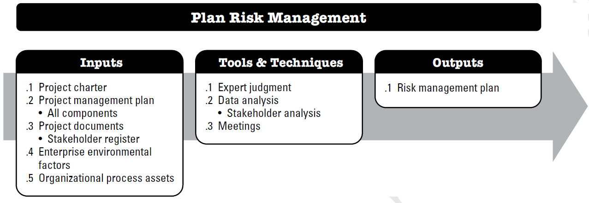{width="80%"}
    <figcaption>Risk Management Planning: Input, tools and output</figcaption>
    
<i>Image Source: PMBOK 6th Edition, chapter 11</i>

</figure>

### 4.2.2 Risk Identification

The process of examining the program areas and each critical technical process to identify and document the associated risk.

<figure markdown="span">
    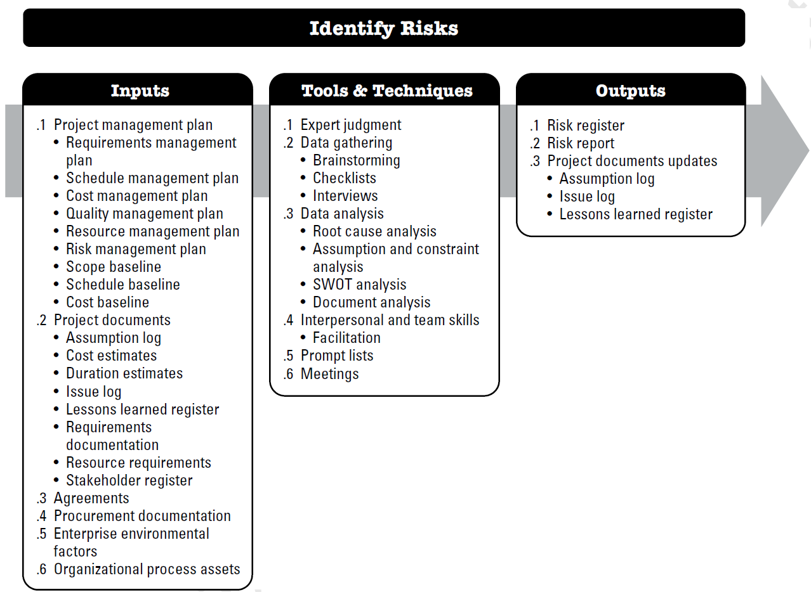{width="80%"}
    <figcaption>Risk Identification: Input, tools and output</figcaption>
    
<i>Image Source: PMBOK 6th Edition, chapter 11</i>

</figure>

- Determines which risks may affect the project and documents their characteristics
- Uses techniques like brainstorming, expert interviews, checklists, SWOT analysis, and documentation reviews
- Results in a risk register that captures all identified risks
- OPTIONAL READING[^2]: [Additional Reading Material](https://www.pmi.org/learning/library/risk-identification-life-cycle-tools-7784)

The Output of the Risk identification step should be :

1.  Risk register: The risk register captures details of identified individual project risks. The risk register captures details of identified individual project risks. On completion of the Identify Risks process, the content of the risk register may include but is not limited to: List of identified risks with unique Identifier, Potential risk owners, List of potential risk responses

2.  Risk Report: The risk report presents information on sources of overall project risk, together with
    summary information on identified individual project risks. The risk report is developed
    progressively throughout the Project Risk Management process

3.  Update on few documents such as Assumption log, issue log, lesson learned register

#### 4.2.2.1 Brain Storming and Delphi Technique

1.  **Brain Storming**

    - A collaborative technique where the project team generates as many potential risks as possible without immediate criticism. Encourages creativity and broad participation.

      | Advantages                                       | Limitations                                 |
      | ------------------------------------------------ | ------------------------------------------- |
      | Leverages collective knowledge and experience    | May be influenced by dominant personalities |
      | Generates creative and unexpected risk scenarios | Quality depends on participant expertise    |
      | Builds team awareness and buy-in                 | Can miss systematic or technical risks      |
      | Cost-effective and relatively quick              | Requires skilled facilitation               |

2.  **Delphi Technique**

    - An expert-based approach where multiple rounds of anonymous questionnaires are distributed to experts. Feedback is refined until consensus is reached on the most critical risks.

      - Key Characteristics:

        - **Anonymous Participation:** Experts provide input without knowing others' identities
          - **Iterative Process:** Multiple rounds of questionnaires
          - **Statistical Feedback:** Participants receive summarized results from previous round
          - **Convergence Focus:** Aims to reach consensus or identify areas of disagreement

      - Step:

        - **Step 1:** A panel of experts is selected from both inside and outside the organization. The experts do not interact on a face-to-face basis and may not even know who else sits on the panel.
        - **Step 2:** Each expert is asked to make an anonymous prediction on a particular subject.
        - **Step 3:** Each expert receives a composite feedback of the entire panel’s answers and is asked to make new predictions based upon the feedback. The process is then repeated as necessary

        | Advantages                                         | Limitations                                   |
        | -------------------------------------------------- | --------------------------------------------- |
        | Eliminates geographic and scheduling constraints   | Time-intensive process (weeks to months)      |
        | Reduces influence of dominant personalities        | Participant dropout between rounds            |
        | Leverages expert knowledge systematically          | May oversimplify complex interdependent risks |
        | Provides structured approach to consensus building | Quality depends on expert selection           |

#### 4.2.2.2 SWOT Analysis

**_SWOT (Strengths, Weaknesses, Opportunities, Threats)_** analysis adapted specifically to identify internal and external risk factors that could impact project success.

1.  **Strength** [^3]

    - Strengths are your company’s core competencies and ==unique selling propositions (USPs)==. These strengths are the foundation upon which you build your competitive advantage.
    - Goal : Compare your strengths against your competitors so that you get a clear picture of what sets you apart.
    - **_It speaks to where you have a competitive advantage in your project or organization._** [^4]
    - While analyzing, you need to consider factors such as your team’s expertise, proprietary technology, brand reputation, financial resources, and established customer relationships.

2.  **Weakness** [^3]

    - Weaknesses are internal factors that hinder your organization’s performance or put it at a disadvantage compared to competitors
    - Goal : identify internal limitations, gaps, or deficiencies that could hinder success.
    - Examples of weaknesses can be limited resources, lack of expertise in certain areas, outdated technology, or inefficient processes that impede growth and success.
    - These could be similar to the Achilles' heel of your organization.[^5]

3.  **Opportunity** [^3]

    - This step focuses on finding out what favorable external factors and market trends can be seized to your advantage.
    - Goal : evaluate untapped markets, emerging technologies, and potential partnerships that align with your strengths.

4.  **Threats** [^3]

    - They are external factors that have the potential to disrupt or harm your business.
    - Threats are external factors that can negatively impact your business
    - Examples of threats are market volatility, disruptive technologies, and aggressive competitors

<figure markdown="span">
    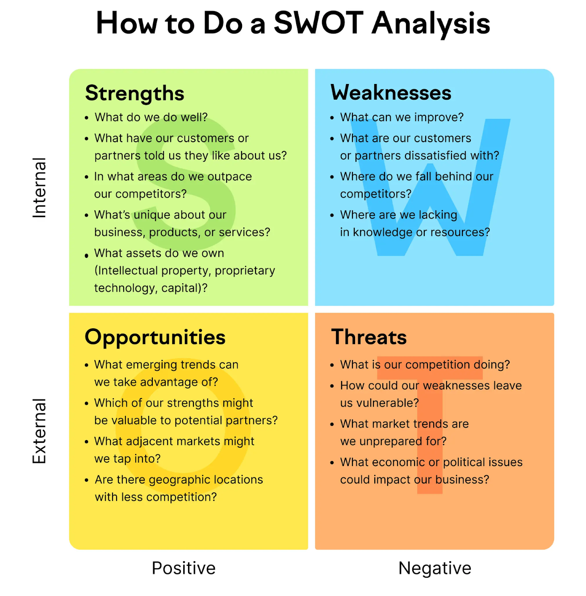{width="60%"}
    <figcaption>Fig 1: SWOT Matrix</figcaption>
</figure>

| Advantages                                           | Limitations                                   |
| ---------------------------------------------------- | --------------------------------------------- |
| Provides comprehensive internal/external perspective | May oversimplify complex risk relationships   |
| Links risks to strategic context                     | Subjective interpretation of factors          |
| Easy to understand and communicate                   | Static snapshot in time                       |
| Can be combined with other techniques                | May miss dynamic interactions between factors |

#### 4.2.2.3 Risk Breakdown Structure

Provide a means for grouping individual project risks. A common way to structure risk categories is with a risk breakdown structure (RBS), which is a hierarchical representation of potential sources of risk.

<figure markdown="span">
    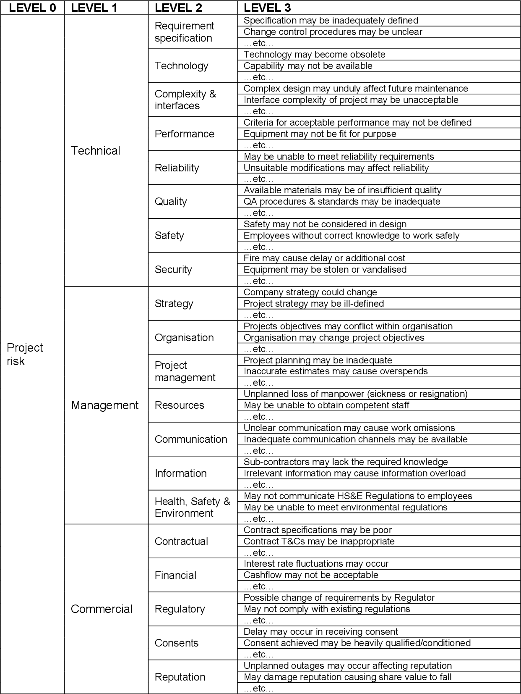{width="50%"}
    <figcaption>RBS format</figcaption>
</figure>

### 4.2.3. Qualitative Risk Analysis

Risk analysis is a systematic process to estimate the level of risk for identified and approved risks. This involves estimating the ==**_probability of occurrence_**== and ==**_consequence of occurrence_**== and converting the results to a corresponding risk level say, 1-10 or High-medium-low

Risk analysis begins with a detailed evaluation of the risks that have been identified and approved by decision-makers for further evaluation. The objective is to gather enough information about the risks to estimate the probability of occurrence and consequence of occurrence if the risk occurs and convert the resulting values to a corresponding risk level.

**Qualitative Risk Analysis** focuses on subjective assessment using descriptive scales (high/medium/low) to evaluate probability and impact. It's faster, less costly, and useful for initial screening of risks.

<figure markdown="span">
    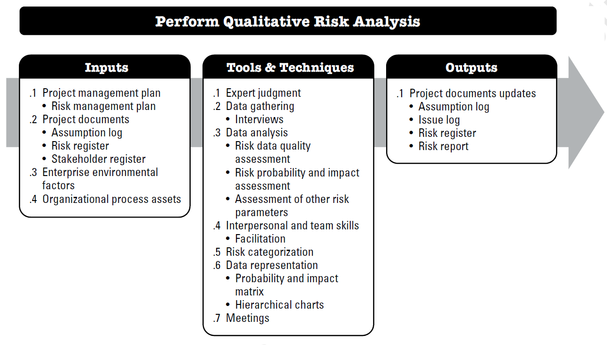{width="80%"}
    <figcaption>Perform Qualitative analysis: Input, tools and output</figcaption>
    
<i>Image Source: PMBOK 6th Edition, chapter 11</i>

</figure>

A commonly used qualitative risk analysis methodology involves risk scales (templates) for estimating probability of occurrence and consequence of occurrence(impace), coupled with a risk mapping matrix. The risk is evaluated using expert opinion against all relevant probability of occurrence scales as well as the three consequences of occurrence scales (cost, technical performance, and schedule), and the results are then transferred onto a risk mapping matrix to convert these values to a corresponding risk level.[^1]

!!! note ""

    The Qualitative Risk Analysis process continues after an initial assessment. Risks and their prioritizations may change as the project progresses, making it essential to repeat this process at different project stages (Project Management Institute, 2023).

#### 4.2.3.1 Probability and Impact Matrix

A Probability and Impact (P-I) Matrix is a qualitative tool that combines two dimensions of risk assessment to determine overall risk severity and priority.

**Probability Scale:** Definitions of risk probability and impact levels are specific to the project context and reflect the risk appetite and thresholds of the organization and key stakeholders. The project may generate specific definitions of probability and impact levels or it may start with general definitions provided by the organization. The number of levels
reflects the degree of detail required for the Project Risk Management process, with more levels used for a more detailed risk approach (typically five levels), and fewer for a simple process (usually three).

<figure markdown="span">
    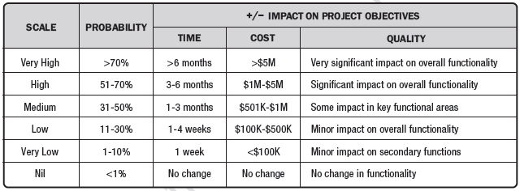{width="100%"}
    <figcaption>Example of definition for probability and impact</figcaption>
    
<i>Image Source: PMBOK 6th Edition, chapter 11</i>

</figure>

**Impact Scale:**

- Very High: Catastrophic effect on objectives
- High: Major impact requiring significant intervention
- Medium: Moderate impact with manageable consequences
- Low: Minor impact with minimal effect
- Very Low: Negligible impact

<figure markdown="span">
    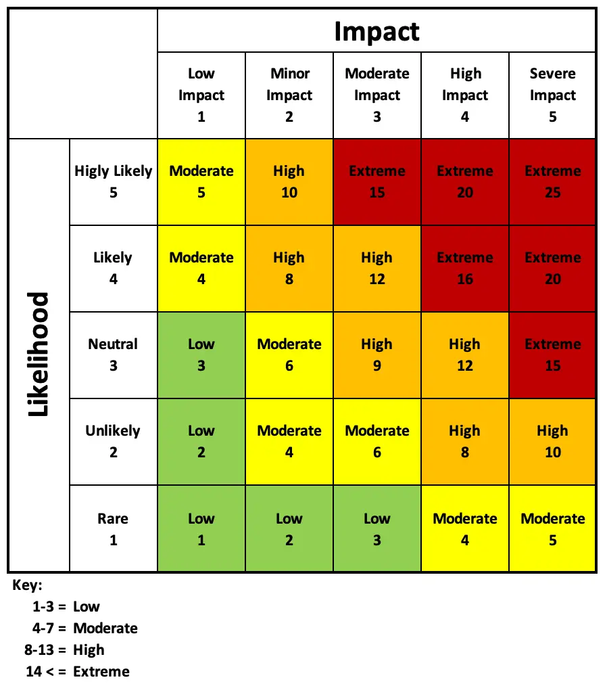{width="60%"}
    <figcaption>Perform Qualitative analysis: Input, tools and output</figcaption>
    
<i>Image Source: <a href="https://www.rosemet.com/qualitative-risk-analysis/"> Project Management Training</a ></i>

</figure>

**_Risk Rating Zones_**

The matrix typically creates three zones:

- **Red Zone (High Risk)**: Requires immediate attention and response planning
- **Yellow Zone (Medium Risk)**: Requires monitoring and contingency planning
- **Green Zone (Low Risk)**: Can be added to a watch list

<figure markdown="span">
    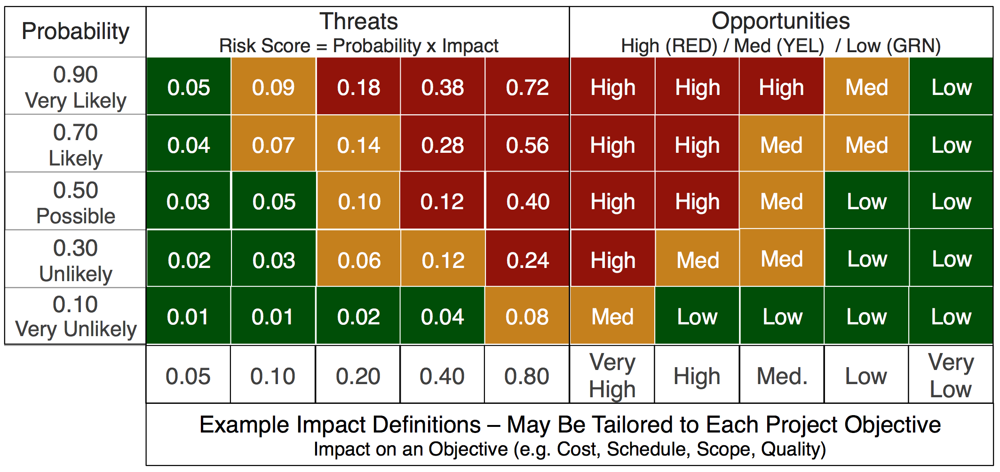{width="60%"}
    <figcaption>Perform Qualitative analysis: Input, tools and output</figcaption>
    
<i>Image Source: <a href="https://industrialaudit.com/risk-mitigation/">  Industrial Audit Corporation - Workface Efficiency</a ></i>

</figure>

**_Application Process_**

1. Identify each risk
2. Assess probability of occurrence
3. Evaluate potential impact on project objectives (cost, schedule, scope, quality)
4. Plot on the matrix
5. Calculate risk score (Probability × Impact)
6. Prioritize based on position in matrix

OPTIONAL READING:[Understanding What is Qualitative Risk Analysis](https://www.rosemet.com/qualitative-risk-analysis/) [^6]

**_Advantages_**

- Simple and quick to implement
- Visual representation aids communication
- Helps prioritize limited resources
- Suitable for projects with limited data

**_Limitations_**

- Subjective assessments may vary between evaluators
- Doesn't provide specific monetary values
- May oversimplify complex risks
- Risk scores don't directly translate to decision-making criteria

---

### 4.2.4 Quantitative Risk analysis

**Quantitative Risk Analysis** uses numerical data and statistical methods to calculate specific probabilities and monetary impacts. It provides precise measurements and is typically performed on high-priority risks identified through qualitative analysis.

The key benefit of this process is that it quantifies overall project risk exposure, and it can also provide additional quantitative risk information to support risk response planning. This process is not required for every project, but where it is used, it is performed throughout the project.[^7]

<figure markdown="span">
    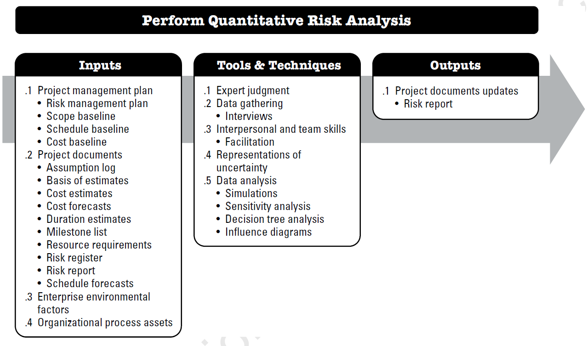{width="80%"}
    <figcaption>Quantitative Analysis: Input, tools and output</figcaption>
    
<i>Image Source: PMBOK 6th Edition, chapter 11</i>

</figure>

#### 4.2.4.1 Expected Monetary Value (EMV) Analysis

EMV is a quantitative technique that calculates the average outcome when the future includes scenarios that may or may not happen. It multiplies the probability of each possible outcome by its monetary impact.

**Formula**

$$EMV = Probability × Impact$$

For multiple scenarios: $EMV = Σ(P_i × I_ i)$ Where $P_i$ = Probability of scenario i, and $I_i$ = Impact of scenario i

!!! example "Example"

    Imagine a project manager is considering whether to invest in upgrading the software used by their team. They estimate there’s a 20% chance that the software upgrade will encounter compatibility issues with existing systems, resulting in a delay that could cost the company $50,000 in lost productivity.

    To calculate the Expected Monetary Value of this decision:

    1. Probability of compatibility issues = 20%

    2. Financial impact of delay = $50,000

    $EMV = Probability*Impact$

    $EMV = 0.20*50,000$

    EMV=$10,000

    This indicates that if the project manager were to proceed with the software upgrade multiple times under similar circumstances, they would expect an average loss of $10,000 per upgrade due to the risk of compatibility issues.

    Example Source[^8]: [Invensis Learning](https://www.invensislearning.com/blog/what-is-expected-monetary-value-emv/)

**Application in Decision Making**

1. **Contingency Reserve Calculation:**
   Sum all negative EMVs to determine appropriate contingency budget.

2. **Opportunity Assessment:**
   Compare positive EMVs to determine which opportunities to pursue.

3. **Net EMV:**
   Total EMV = Sum of all positive EMVs + Sum of all negative EMVs

**_Practical Example_**

A project faces three risks:

1. Vendor delay: 25% probability, 40,000 impact = -10,000 EMV
2. Resource shortage: 15% probability, 60,000 impact = -9,000 EMV
3. Early completion bonus: 35% probability, 30,000 benefit = +10,500 EMV

Total EMV = -10,000 + (-9,000) + 10,500 = -8,500

This suggests a contingency reserve of at least $8,500 should be allocated.

**Advantages**

- Provides objective, numerical basis for decisions
- Helps justify contingency reserves
- Facilitates comparison between different risk response options
- Useful for cost-benefit analysis

**Limitations**

- Requires reliable probability and impact data
- Assumes risk neutrality (may not reflect actual risk tolerance)
- Doesn't account for timing of risks
- Single point estimate may not capture full uncertainty

---

#### 4.2.4.2 Decision Tree Analysis for Risk Evaluation

Decision tree analysis is a quantitative technique that uses a branching diagram to map out various decision paths, their associated uncertainties, and potential outcomes. It's particularly valuable for sequential decisions where each choice affects future options.

Decision trees are used to support selection of the best of several alternative courses of action. Alternative paths through the project are shown in the decision tree using branches representing different decisions or events, each of which can have associated costs and related individual project risks (including both threats and opportunities).

**_Structure Components_**

<figure markdown="span">
    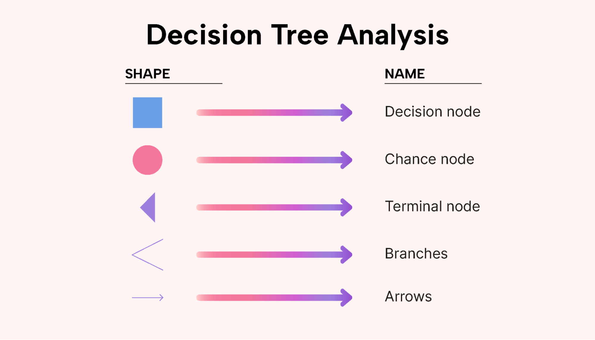{width="60%"}
    <figcaption>Perform Qualitative analysis: Input, tools and output</figcaption>
    
<i>Image Source: <a href="https://www.usemotion.com/blog/decision-tree-analysis"> Decision Tree Analysis: A Step-by-Step Guide</a ></i>

</figure>

**Decision Nodes (Squares):**
Points where a choice must be made between alternatives and represents controllable decisions by the project team

**Chance Nodes (Circles):**
Points where uncertain events occur and represents uncontrollable outcomes with associated probabilities

**End Nodes (Triangles):**
Terminal points showing final outcomes and display the resulting value or payoff

**Branches:**
Lines connecting nodes representing different paths and each branch from a chance node has an associated probability

**_Construction Process_**

1. **Identify the Decision**: Start with the primary decision to be made
2. **Map Alternatives**: Draw branches for each possible choice
3. **Add Uncertain Events**: Include chance nodes for uncertainties following each decision
4. **Assign Probabilities**: Attach probability values to each branch from chance nodes (must sum to 100%)
5. **Determine Outcomes**: Calculate or estimate the monetary value at each end node
6. **Calculate EMV**: Work backwards from right to left, calculating EMV at each chance node
7. **Choose Best Path**: Select the decision branch with the highest EMV

!!! example "Example"

    Consider a decision that needs to be taken by a commercial property owner who wants to increase their revenue in an existing commercial block and need to decide which course of action is best among the following:

    1. Maintain the block
    2. Renovate the block
    3. Re-build the block

    Through market research, the property owner has established that there is a potential to increase the revenue of their block by up to 60 million over the 20-year land lease period that they hold, largely depending on the quality of the outlets and volume of customers this will generate.

    1. The cheapest option will be to just maintain the block and hope to attract more customers by keeping the block as clean and well maintained as possible which would cost 3 million over the 20-year lease period. However, the best case would be an overall increase in revenue of 20 million and their worst case would be no increase in revenue.

    2. The next option would be to renovate the block to improve its layout, access, and services. This option would cost 8 million in construction, 2million in trade disruption and the same 3 million in maintenance, totalling 12 million. Maximum expected increase in revenue would be 45 million and the minimum expected increase would be 25 million.

    3. Their final option would be to rebuild the entire block to provide more space, better facilities and an overall improvement in the architecture and appeal of the block. This option would cost 17 million in construction, 6 million in trade disruption and would reduce their overall maintenance costs to 2 million, totalling 25 million. Maximum expected increase in revenue would be 60 million and the minimum expected increase would be 30 million.

    The property owner naturally wants to maximise revenue, and a complete rebuild of the block could potentially deliver the highest return. However, the likelihood of actually achieving this maximum gain depends on the probability of each outcome.

    In this example:

    **Option-1** has a 90% chance of success given the area’s demographics, with a 10% chance of failure.

    Both the **Option-2** and **Option-3** have a 70% probability of reaching their maximum targets and a 30% chance of only meeting minimum expectations.

    To identify the most favourable strategy, we must now construct a decision tree that incorporates the costs, expected returns, and the probabilities of each outcome.

    <figure markdown="span">
        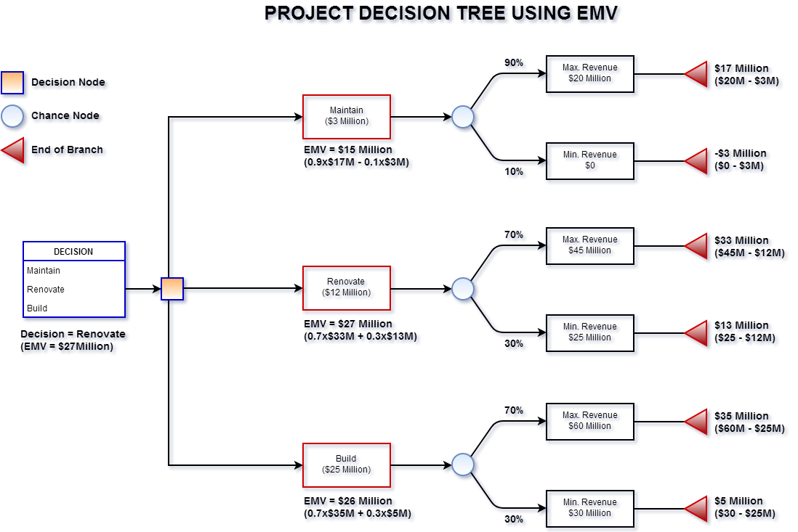{width="90%"}
        <figcaption>Decision Tree using Expected Monetary Value</figcaption>
        
<i>Image Source: <a href="https://www.project-risk-manager.com/blog/expected-monetary-value/"> Site: Project Risk manager</a ></i>

    </figure>

    Source : [Project Risk manager](https://www.project-risk-manager.com/blog/expected-monetary-value/)

**_Advanced Applications_**

**Multi-Stage Decisions:** Decision trees can model sequential decisions where early choices affect later options and probabilities.

**Sensitivity Analysis:** Test how changes in probabilities or values affect the optimal decision.

**Risk Profiles:** Examine the distribution of outcomes, not just the expected value.

**Advantages**

- Visualizes complex decision scenarios clearly
- Handles sequential and dependent decisions
- Incorporates both controllable and uncontrollable factors
- Provides transparent rationale for decisions
- Facilitates communication with stakeholders
- Useful for comparing multiple alternatives simultaneously

**Limitations**

- Can become complex with many branches
- Requires reliable probability estimates
- May oversimplify by using discrete scenarios
- Time-consuming to construct for complex situations
- Doesn't capture all possible outcomes (uses discrete paths)
- Based on expected values, may not reflect risk appetite

#### Integration of These Methods

These three techniques work best when used together in a comprehensive risk management approach:

1. **Start with P-I Matrix** for initial risk screening and prioritization
2. **Apply EMV Analysis** to high-priority risks to quantify exposure and determine reserves
3. **Use Decision Trees** for complex decisions involving multiple options and sequential uncertainties

### 4.2.5 Plan Risk Response

Plan Risk Responses is the process of developing options, selecting strategies, and agreeing on actions to address overall project risk exposure, as well as to treat individual project risks. The key benefit of this process is that it identifies appropriate ways to address overall project risk and individual project risks. This process also allocates resources and inserts activities into project documents and the project management plan as needed. This process is performed throughout the project.[^7]

<figure markdown="span">
    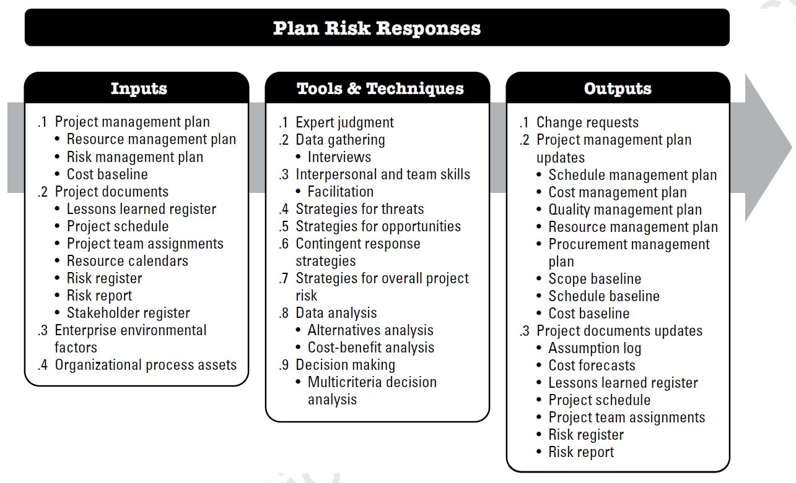{width="80%"}
    <figcaption>Plan Risk Response: Input, tools and output</figcaption>
    
<i>Image Source: PMBOK 6th Edition, chapter 11</i>

</figure>

The main risk response strategies for negative risks are listed below.

1.  **Avoid**

    - This risk response strategy is about ==**_removing the threat by any means_**==.
    - It’s a proactive approach that aims to eliminate the possibility of a risk occurring to help protect the project from its impact.
    - That can mean changing your project management plan to avoid the risk because it’s detrimental to the project. This strategy is ideal to use when the risk has a high probability and/or a significant negative impact.
    - It’s also useful when the risk is beyond the organization’s risk tolerance and there are viable alternatives.

2.  **Mitigate**

    Some project risks you just can’t avoid. Risk mitigation involves planning, developing and implementing options to reduce the probability of a risk even occurring. The goal isn’t necessarily to eliminate all risk, but instead to reduce it to a more acceptable level. Risk mitigation is usually used when the risk cannot be avoided entirely or the potential impact is significant enough to warrant action. It’s also used when there are opportunities to reduce the likelihood or impact through specific actions.

3.  **Transfer**
    As the name implies, here you’ll transfer or pass the work on resolving the project risk to a third party, such as buying insurance or getting a warranty and guarantee. The core of a risk transfer is moving the potential financial impact of a risk event to another entity. The party inheriting the risk usually utilizes a formal agreement or contract when accepting the risk.

    A risk transfer is typically utilized when there aren’t enough resources or expertise available to manage a specific risk. It also allows the project team to focus on core project objectives and they can minimize distractions when risk responsibilities are transferred.

4.  **Accept**
    This risk response strategy consists of identifying a risk and documenting all the risk management information about it, but not taking any action unless the risk occurs. This is a deliberate decision, not an oversight, as the team consciously accepts the potential consequences should the risk occur.

    Risk acceptance is typically used when the potential risk impact is low or the probability of the risk happening is low. It may also be used when there are no cost-effective alternative responses or if the project has sufficient contingency reserves.

5.  **Monitor**
    Risk monitoring consists of continuously tracking identified risks and monitoring trigger conditions. It aims to answer questions like “how has the risk changed, are there new risks that have emerged or are the risk mitigation plans working as expected?” Large, complex projects benefit from risk monitoring or those with tight deadlines or budgets. It’s also useful in projects utilizing new or unproven technologies.

6.  **Buffer**
    This strategy revolves around adding extra resources, such as time or budget, to a project plan to absorb potential disruptions or negative impacts that a risk can cause. It creates a cushion that helps the project stay on scope, schedule and budget even if the risk materializes. This approach is especially useful when the project has a high degree of uncertainty or the impact of potential risks can be significant. It’s also used in projects where maintaining the project timeline or budget is critical.

The main risk response strategies for Positive risks are listed below.

1.  **Exploit**

    The exploit strategy may be selected for high-priority opportunities where the organization wants to ensure that the opportunity is realized. This strategy seeks to capture the benefit associated with a particular opportunity by
    ensuring that it definitely happens, increasing the probability of occurrence to 100%. Examples of exploiting responses may include assigning an organization's most talented resources to the project to reduce the time to
    completion, or using new technologies or technology upgrades to reduce cost and duration.

2.  **Share**

    Sharing involves transferring ownership of an opportunity to a third
    party so that it shares some of the benefit if the opportunity occurs. It is
    important to select the new owner of a shared opportunity carefully so they are
    best able to capture the opportunity for the benefit of the project. Risk sharing
    often involves payment of a risk premium to the party taking on the
    opportunity. Examples of sharing actions include forming risk-sharing
    partnerships, teams, special-purpose companies, or joint ventures.

3.  **Enhance**

    The enhance strategy is used to increase the probability and/or
    impact of an opportunity. Early enhancement action is often more effective
    than trying to improve the benefit after the opportunity has occurred. The
    probability of occurrence of an opportunity may be increased by focusing
    attention on its causes. Where it is not possible to increase probability, an
    enhancement response might increase the impact by targeting factors that drive
    the size of the potential benefit. Examples of enhancing opportunities include
    adding more resources to an activity to finish early.

4.  **Accept**

    Accepting an opportunity acknowledges its existence but no proactive
    action is taken. This strategy may be appropriate for low-priority opportunities,
    and it may also be adopted where it is not possible or cost-effective to address
    an opportunity in any other way. Acceptance can be either active or passive.
    The most common active acceptance strategy is to establish a contingency
    reserve, including amounts of time, money, or resources to take advantage of
    the opportunity if it occurs. Passive acceptance involves no proactive action
    apart from periodic review of the opportunity to ensure that it does not change
    433significantly.

### 4.2.6 Implement Risk response

Implement Risk Responses is the process of implementing agreed-upon risk response plans. The key benefit of this process is that it ensures that agreed-upon risk responses are executed as planned in order to address overall project risk exposure, minimize individual project threats, and maximize individual project opportunities.

<figure markdown="span">
    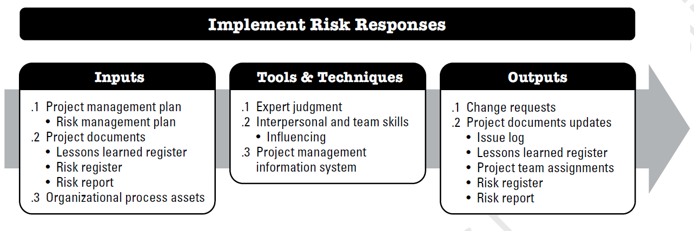{width="80%"}
    <figcaption>Implement Risk Response: Input, tools and output</figcaption>
    
<i>Image Source: PMBOK 6th Edition, chapter 11</i>

</figure>

Proper attention to the Implement Risk Responses process will ensure that agreed-upon risk responses are actually executed. A common problem with Project Risk Management is that project teams spend effort in identifying and analyzing risks and developing risk responses, then risk responses are agreed upon and documented in the risk register and risk
report, but no action is taken to manage the risk.

#### 4.2.6.1 Identifying Trigger Conditions and Warning Signs

Trigger conditions are **specific, measurable indicators** that **_signal when a risk is about to occur or has occurred_**. Warning signs are early indicators that suggest a risk is materializing, allowing the project team to take proactive action before the risk fully impacts the project.
Key Components:

1.  **_Types of Triggers:_**

    - **Quantitative triggers**: Specific numerical thresholds (e.g., budget variance exceeding 10%, schedule delay of more than 5 days)

    - **Qualitative triggers**: Observable conditions or events (e.g., key stakeholder expressing dissatisfaction, team morale declining)

    - **Time-based triggers**: Specific dates or milestones (e.g., 30 days before critical delivery date)

    - **Event-based triggers**: Particular occurrences (e.g., regulatory change announced, key supplier bankruptcy)

2.  **_Characteristics of Effective Triggers:_**

    - **Specific and measurable:** Clear criteria that can be objectively assessed

    - **Observable** Can be monitored through available data and information

    - **Timely:** Provide sufficient advance notice to implement response plans

    - **Relevant**: Directly related to the risk event

    - **Actionable:** Lead to clear response actions when activated

3.  **_Developing Trigger Conditions:_**

    - Analyze historical data from similar projects
    - Consult with subject matter experts
    - Review risk probability and impact assessments
    - Consider lead time needed for response implementation
    - Establish baseline metrics for comparison

4.  **_Warning Sign Identification Process:_**

    - Document early indicators for each identified risk
    - Establish monitoring mechanisms for warning signs
    - Define escalation protocols when warning signs appear
    - Create communication channels for reporting warning signs
    - Train team members to recognize warning signs

5.  **_Examples of Common Warning Signs:_**

    - Schedule risks: Tasks consistently finishing late, critical path activities showing delays, resource calendars becoming overbooked
    - Budget risks: Actual costs exceeding estimates, burn rate increasing, scope creep occurring
    - Quality risks: Defect rates rising, rework increasing, testing failures mounting
    - Resource risks: Key personnel showing signs of burnout, resignation rumors, skill gaps emerging
    - Stakeholder risks: Meeting attendance declining, feedback becoming negative, decision-making delays

#### 4.2.6.2 Integrating Risk Responses into Project Activities

Integration of risk responses ensures that risk management activities are embedded within normal project workflows rather than treated as separate, parallel processes. This approach makes risk management a natural part of daily project execution.
Key Integration Strategies:

1.  **_Incorporation into Project Planning:_**

    - Include risk response actions in the work breakdown structure (WBS)
    - Allocate budget for risk response implementation
    - Schedule risk response activities in the project timeline
    - Assign resources specifically for risk mitigation tasks
    - Define risk-related deliverables and milestones

2.  **_Integration with Project Processes:_**

    - Scope management: Include risk mitigation requirements in scope statements
    - Schedule management: Build buffer time for high-probability risks
    - Cost management: Establish contingency reserves for identified risks
    - Quality management: Incorporate risk-based quality controls
    - Resource management: Cross-train team members as risk mitigation
    - Communications management: Include risk reporting in regular communications
    - Procurement management: Include risk clauses in contracts

3.  **_Making Risk Responses Part of Daily Operations:_**

    - Include risk discussions in daily stand-up meetings
    - Add risk review to weekly team meetings
    - Incorporate risk considerations into decision-making processes
    - Make risk information visible through dashboards and displays
    - Embed risk checkpoints in workflow approvals

4.  **_Resource Allocation for Risk Responses:_**

    - Dedicate team members to specific risk response activities
    - Allocate budget from contingency reserves when needed
    - Secure specialized expertise for complex risk responses
    - Ensure tools and equipment are available for response implementation
    - Plan for potential resource reallocation when risks materialize

5.  **_Ownership and Accountability:_**

    - Assign risk owners responsible for monitoring and response
    - Define clear roles and responsibilities for response execution
    - Establish authority levels for activating responses
    - Create accountability mechanisms for response effectiveness
    - Link performance evaluations to risk management responsibilities

6.  **_Documentation and Tracking:_**

    - Update project plans to reflect risk response activities
    - Track progress of risk response implementation
    - Document resources consumed by risk responses
    - Record changes made due to risk responses
    - Maintain audit trail of risk-related decisions

#### 4.2.6.3 Measuring the Effectiveness of Risk Responses

Measuring effectiveness involves systematically evaluating whether implemented risk responses achieve their intended objectives of reducing probability, impact, or overall risk exposure. This assessment helps determine if adjustments are needed and provides valuable lessons for future projects.
Key Measurement Approaches:

1.  **Defining Success Criteria:**

    - Establish specific, measurable objectives for each risk response
    - Define target risk reduction (e.g., reduce probability from 60% to 20%)
    - Set acceptable residual risk levels
    - Identify key performance indicators (KPIs) for risk responses
    - Document baseline conditions before response implementation

2.  **Quantitative Measurement Methods:**

    - **_Risk exposure calculation_**: Compare expected monetary value (EMV) before and after response implementation
    - **_Probability reduction_**: Measure actual change in likelihood of risk occurrence
    - **_Impact reduction_**: Assess actual decrease in consequences if risk occurs
    - **_Cost-benefit analysis_**: Compare cost of response to value of risk reduction
    - **_Return on investment (ROI)_**: Calculate financial return from risk response investment
    - **_Variance analysi_**s: Compare actual risk outcomes to predicted outcomes

3.  **Qualitative Measurement Methods:**

    - Expert judgment on risk reduction achieved
    - Stakeholder satisfaction with risk management
    - Team confidence in handling potential risks
    - Quality of risk response execution
    - Completeness of risk response implementation

4.  **Measurement Metrics:**

    - Response implementation rate: Percentage of planned responses actually executed
    - Response timeliness: Whether responses were implemented on schedule
    - Resource efficiency: Actual vs. planned resources consumed
    - Risk velocity change: Improvement in time available to respond
    - Secondary risk generation: Number of new risks created by responses
    - Residual risk level: Remaining risk after response implementation

5.  **Evaluation Process:**

    - Conduct regular reviews of risk response effectiveness
    - Compare current risk ratings to original assessments
    - Gather feedback from risk owners and team members
    - Analyze whether trigger conditions were accurate predictors
    - Review documentation of response execution
    - Assess whether responses addressed root causes

6.  **Common Effectiveness Indicators:**

    - Successful avoidance: Risk did not materialize as predicted
    - Reduced occurrence: Risk happened less frequently than expected
    - Minimized impact: Consequences were less severe than anticipated
    - Improved preparedness: Team responded more effectively when risk occurred
    - Enhanced capabilities: Organization's ability to handle similar risks improved

7.  **Addressing Ineffective Responses:**

    - Identify reasons why responses didn't work as expected
    - Develop corrective actions for underperforming responses
    - Reallocate resources to more effective strategies
    - Escalate persistent risks to senior management
    - Document lessons learned for future improvement

### 4.2.7 Monitor Risks

Monitor Risks is the process of monitoring the implementation of agreed-upon risk response plans, tracking identified risks, identifying and analyzing new risks, and evaluating risk process effectiveness throughout the project. The key benefit of this process is that it enables project decisions to be based on current information about overall project risk exposure and individual project risks.

<figure markdown="span">
    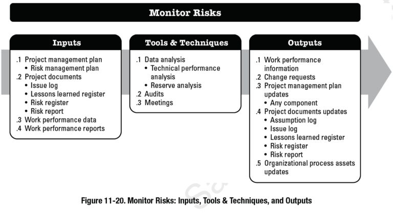{width="80%"}
    <figcaption>Monitor Risk: Input, tools and output</figcaption>
    
<i>Image Source: PMBOK 6th Edition, chapter 11</i>

</figure>

#### 4.2.7.1 Conducting Risk Audits

Risk audits are systematic, independent examinations of risk management processes.
Risk Audits:

1.  **What is the Purpose of Risk Audits**:

    - Evaluate effectiveness of risk management processes
    - Verify compliance with risk management plans
    - Identify gaps in risk identification or response
    - Assess quality of risk documentation
    - Validate that risk responses are being implemented
    - Ensure resources are appropriately allocated
    - Examine organizational risk culture and practices

2.  **Types of Risk Audits**:

    - Process audits: Examine how risk management processes are followed
    - Compliance audits: Verify adherence to standards and policies
    - Performance audits: Assess effectiveness of risk management outcomes
    - Documentation audits: Review completeness and accuracy of risk records
    - Response audits: Evaluate implementation and effectiveness of risk responses

3.  **Audit Methodology**:

    - Review risk management documentation (plans, registers, reports)
    - Interview project team members and stakeholders
    - Observe risk management activities in practice
    - Sample risk responses for detailed evaluation
    - Compare actual practices to documented procedures
    - Benchmark against industry best practices
    - Analyze risk management metrics and trends

4.  **Audit Frequency**:

    - Scheduled audits at key project milestones
    - Phase-end audits during project transitions
    - Post-incident audits after major risk events
    - Random or surprise audits for compliance verification
    - Continuous audit activities for high-risk projects

5.  **Audit Outputs**:

    - Audit reports documenting findings
    - Recommendations for improvement
    - Identification of best practices to replicate
    - Action items for correcting deficiencies
    - Updates to risk management procedures
    - Lessons learned documentation

#### 4.2.7.2 Risk Reassessments

Reassessments involve periodic re-evaluation of identified risks to determine if their characteristics have changed

1.  **Purpose of Reassessments**:

    - Update risk probability and impact ratings
    - Identify changes in risk priority
    - Determine if new information affects risk status
    - Assess whether previous assumptions remain valid
    - Evaluate effectiveness of implemented responses
    - Decide if risks can be closed or require new responses

2.  **Reassessment Triggers**:

    - Regular intervals (weekly, monthly, quarterly)
    - Significant project changes or milestones
    - Major external environment changes
    - After implementation of risk responses
    - When warning signs or triggers are observed
    - Stakeholder requests or concerns
    - Availability of new information

3.  **Reassessment Process**:

    - Review current risk register entries
    - Gather updated information on each risk
    - Re-evaluate probability and impact
    - Recalculate risk scores and priority
    - Update risk status (active, occurred, closed, declined)
    - Revise response strategies if needed
    - Document reasons for changes

4.  **Factors to Consider During Reassessment**:

    - Changes in project scope, schedule, or budget
    - New stakeholder requirements or concerns
    - Market or economic condition changes
    - Technological developments
    - Regulatory or legal changes
    - Organizational changes (leadership, strategy, resources)
    - Lessons learned from similar projects
    - Effectiveness of current risk responses

5.  **Reassessment Documentation**:

    - Updated risk ratings and priority rankings
    - Rationale for changes in risk assessment
    - Date and participants in reassessment
    - New response strategies required
    - Resources needed for updated responses
    - Comparison to previous assessments

6.  **Integration of Audit and Reassessment Findings**:

    - Use audit findings to improve reassessment processes
    - Apply reassessment data as evidence in audits
    - Combine insights for comprehensive risk picture
    - Share learnings across project and organization
    - Update risk management methodology based on both activities

#### 4.2.7.3 Using Risk Registers and Risk Burndown Charts

**Risk Registers**: A risk register is a comprehensive document that records all identified risks, their characteristics, and associated management information. It serves as the central repository for risk information throughout the project lifecycle.

<figure markdown="span">
    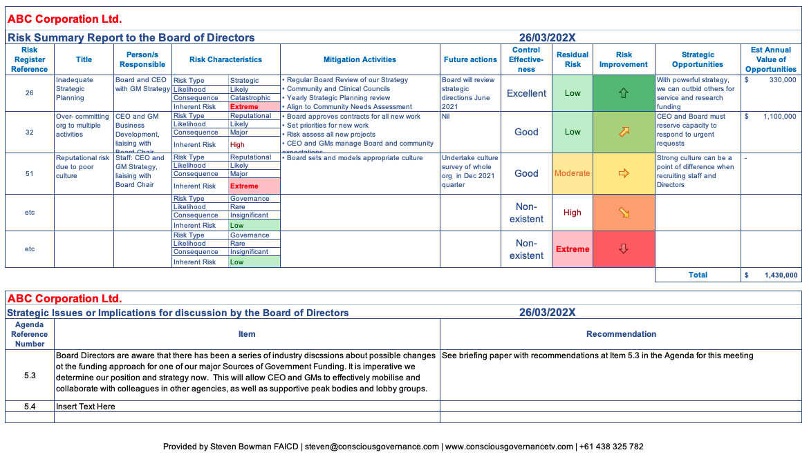{width="100%"}
    <figcaption>Example of Risk register</figcaption>
    
<i>Image Source: <a href="https://www.boardpro.com/risk-register"> BoardPro Limited</a ></i>

</figure>

1.  **Essential Risk Register Components**:

    - **_Risk ID_**: Unique identifier for each risk
    - **_Risk description_**: Clear statement of the risk event and conditions
    - **_Risk category_**: Classification by source or type
    - **_Risk owner_**: Person responsible for monitoring and managing the risk
    - **_Probability_**: Likelihood of occurrence (often rated on a scale)
    - **_Impact_**: Potential consequences if risk occurs (financial, schedule, scope, quality)
    - **_Risk score_**: Combined measure of probability and impact
    - **_Risk priority/ranking_**: Relative importance compared to other risks
    - **_Trigger conditions_**: Warning signs that risk is materializing
    - **_Response strategy_**: Planned approach (avoid, mitigate, transfer, accept)
    - **_Response actions_**: Specific steps to implement strategy
    - **_Response owner_**: Person responsible for executing response
    - **_Status_**: Current state (identified, active, occurred, closed, mitigated)
    - **_Date identified_**: When risk was first recognized
    - **_Target closure date_**: When risk should be resolved
    - **_Residual risk_**: Risk remaining after response implementation
    - **_Cost estimate_**: Budget impact and reserves allocated

2.  **Risk Register Management**:

    - Maintain single source of truth for risk information
    - Establish version control and change tracking
    - Define access rights and editing permissions
    - Set update frequency requirements
    - Integrate with other project management tools
    - Ensure consistent data entry standards
    - Archive historical risk information

3.  **Risk Register Benefits**:

    - Centralized risk information storage
    - Facilitates communication about risks
    - Enables trend analysis over time
    - Supports reporting and decision-making
    - Provides audit trail of risk management activities
    - Captures organizational knowledge
    - Enables portfolio-level risk aggregation

**Risk Burndown Charts:**

**Risk burndown** charts are visual tools that display the reduction of risk exposure over time, showing progress in managing and retiring risks throughout the project lifecycle.

<figure markdown="span">
    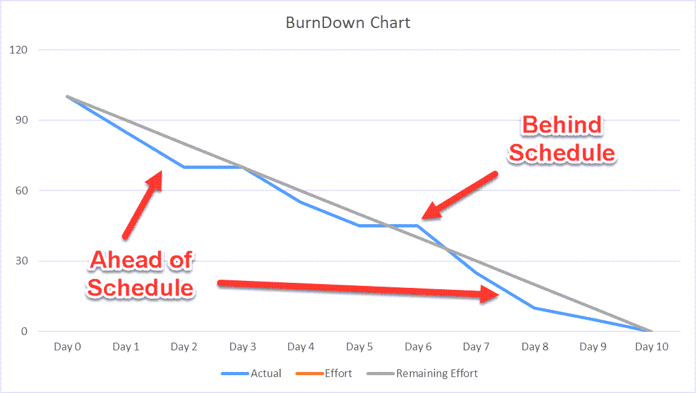{width="80%"}
    <figcaption>Burndown Chart Example</figcaption>
    
<i>Image Source: <a href="https://pmstudycircle.com/burndown-chart/"> PMS Study Circle</a ></i>

</figure>

1.  **Components of Risk Burndown Charts**:

    - X-axis: Time (project timeline, sprints, phases)
    - Y-axis: Risk exposure (sum of risk scores, expected monetary value)
    - Ideal burndown line: Planned rate of risk reduction
    - Actual burndown line: Actual risk reduction achieved
    - Gap analysis: Difference between planned and actual

2.  **Types of Risk Burndown Metrics**:

    - Total risk score (sum of all active risk probability × impact)
    - Number of open/active risks
    - Expected monetary value (EMV) of all risks
    - Cumulative risk exposure
    - High-priority risk count
    - Risk response completion rate

3.  **Interpreting Risk Burndown Charts**:

    - Downward actual line: Successful risk reduction
    - Flat actual line: Risks not being effectively managed
    - Upward actual line: Risk exposure increasing (new risks or growing existing risks)
    - Actual below ideal: Ahead of risk reduction targets
    - Actual above ideal: Behind risk reduction targets
    - Sudden changes: Indicate major risk events or response implementations

4.  **Risk Burndown Chart Uses**:

    - Visualize risk management progress
    - Identify trends in risk exposure
    - Communicate risk status to stakeholders
    - Compare planned vs. actual risk reduction
    - Highlight need for additional risk responses
    - Demonstrate value of risk management efforts
    - Support go/no-go decisions at gates

#### 4.2.7.4 Updating Risk Response Plans

**Updating risk response plans** involves revising strategies, actions, and resources allocated to manage risks based on new information, changing conditions, and feedback from implementation. This ensures response plans remain relevant and effective throughout the project.
When to Update Risk Response Plans:

1.  **Regular Update Cycles**:

    - During scheduled risk reviews (weekly, monthly, phase-end)
    - As part of project status meetings
    - At major project milestones or gates
    - During project replanning activities
    - Following project baseline changes

2.  **Event-Driven Updates**:

    - When risk probability or impact changes significantly
    - After risk responses are implemented
    - When trigger conditions are met
    - Following occurrence of risk events
    - When new risks are identified that interact with existing risks
    - After risk audits or reassessments
    - When lessons learned suggest better approaches
    - In response to stakeholder feedback

3.  **Environmental Changes**:

    - Project scope, schedule, or budget modifications
    - Organizational restructuring or policy changes
    - External environment shifts (market, regulatory, technological)
    - esource availability changes
    - Stakeholder priority shifts

Update Process:

1.  **Assessment Phase**:

    - Review current risk response plan effectiveness
    - Gather feedback from risk owners and team members
    - **Analyze actual results vs. planned outcomes**
    - Identify gaps or deficiencies in current plans
    - Consider new information or changed circumstances
    - Evaluate resource consumption and availability

2.  **Revision Phase**:

    - Modify response strategies if current approach is ineffective
    - Add new response actions to address gaps
    - **_Remove or scale back_** ineffective or unnecessary actions
    - Adjust resource allocations based on priorities
    - Revise timelines for response implementation
    - **_Update cost estimates_** and contingency reserves
    - Refine trigger conditions based on actual experience

3.  **Validation Phase**:

    - Review updated plans with risk owners
    - Verify resource availability for updated plans
    - **_Confirm stakeholder acceptance_** of changes
    - Validate technical feasibility of new approaches
    - Assess impact on other project areas
    - Check compliance with organizational policies

4.  **Communication Phase**:

    - **_Inform all affected parties_** of plan changes
    - Update risk register and related documentation
    - Distribute revised response procedures
    - Train team members on new approaches
    - Confirm understanding and commitment

5.  **Implementation Phase**:

    - Put updated response plans into action
    - Monitor initial results of changes
    - Make quick adjustments if immediate issues arise
    - Document implementation process

## References

[^1]: Kerzner, H. (2009). Project management-A systems approach to planning, scheduling, and control. Hoboken, Nj Wiley.
[^2]: Piney, C. (2003, May 25). Risk identification. Pmi.org. https://www.pmi.org/learning/library/risk-identification-life-cycle-tools-7784
[^3]: Jurčić, M. (2025, February 13). What is a SWOT analysis in project management? Productive. https://productive.io/blog/swot-analysis-in-project-management/
[^4]: Jennifer Bridges. (2022, April 22). How to Perform a SWOT Analysis - ProjectManager.com. ProjectManager.com. https://www.projectmanager.com/training/how-to-perform-a-swot-analysis
[^5]: GeeksforGeeks. (2023, September 28). What is SWOT Analysis Definition, Components, and Working. GeeksforGeeks. https://www.geeksforgeeks.org/blogs/swot-analysis-definition-components-and-working/
[^6]: Shick, M. (2024, February 2). Qualitative Risk Analysis: Simplify Your Risk Assessment. Rosemet LLC. https://www.rosemet.com/qualitative-risk-analysis/
[^7]: Project Management Institute. (2017). A guide to the Project Management Body of Knowledge (PMBOK guide) (6th ed.). Project Management Institute
[^8]: https://www.invensislearning.com/blog/what-is-expected-monetary-value-emv/
