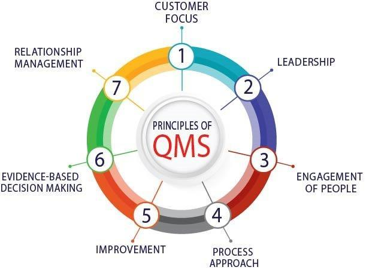

# Unit 6:Quality Management

## 6.1 Software Quality Concepts

### 6.1.1 ISO/IEC 25010 Software Quality Model

### 6.1.2 Internal vs. External Quality Attributes

### 6.1.1.3 User Satisfaction and Software Quality

---

## 6.1.2 Quality Attributes and Metrics

You cannot manage what you cannot measure. Metrics provide an objective way to track quality attributes.

### 6.1.2.1 Reliability and Maintainability Metrics

### 6.1.2.2 Performance Efficiency and Security Metrics

### 6.1.2.3 Usability and Portability Metrics

-

## 6.1.3 Cost of Quality (CoQ) in Software Projects

The Cost of Quality is a concept from manufacturing, powerfully applied to software, that quantifies the total cost of ensuring quality and the cost of _not_ having quality. It is a fundamental tool for justifying quality initiatives to management.

### 6.1.3.1 Prevention Costs

Costs incurred to prevent defects from being introduced in the first place. This is the most proactive and cost-effective investment.

- **Examples:**
  - Training developers on secure coding practices.
  - Process improvement initiatives (e.g., adopting Agile/Scrum).
  - Time spent on formal requirements analysis and design reviews.
  - Implementing tools for continuous integration.

### 6.1.3.2 Appraisal Costs

Costs incurred to identify defects _before_ the software is released to the customer. This is a reactive, but necessary, "inspection" cost.

- **Examples:**
  - Time spent on all forms of testing (unit, integration, system, UAT).
  - Cost of test automation tools and infrastructure.
  - Effort for performing code reviews and static analysis.

### 6.1.3.3 Failure Costs (Internal and External)

Costs incurred because defects have occurred. These are the most expensive and damaging costs.

- **Internal Failure Costs:** Defects found _before_ shipment to the customer.

  - **Examples:** Debugging time, rework, fixing bugs found during testing, regression testing after a fix.

- **External Failure Costs:** Defects found _after_ shipment to the customer.
  - **Examples:**
    - Technical support calls.
    - Bug fixing and patching in production.
    - Hotfix deployments and emergency releases.
    - Damage to brand reputation and loss of future sales.
    - Litigation and penalty costs (in regulated industries like healthcare or finance).

**The Fundamental Rule:** **$1 spent on Prevention can save $10 on Appraisal and $100 on Failure.** A project manager's goal is to shift the quality investment left—spending more on prevention to drastically reduce the much higher costs of failure.

---

Understanding software quality concepts is not an academic exercise; it is a project management imperative.

- A modern definition of quality, like the one provided by **ISO 25010**, gives a holistic view beyond mere functionality.
- Distinguishing between **Internal and External** attributes allows a PM to measure progress and health throughout the lifecycle.
- Defining concrete **Metrics** for attributes like reliability and performance turns subjective quality into an objective, manageable entity.
- Analyzing the **Cost of Quality** provides a powerful financial argument for proactive quality practices, demonstrating that investing in prevention and appraisal is not a cost, but a strategic investment that saves significant money and protects the organization's reputation.

## 6.2.2 Selecting Appropriate Quality Standards

## Core Concept

**Quality Standards** are established, documented agreements containing technical specifications or other precise criteria designed to be used consistently as rules, guidelines, or definitions of characteristics to ensure that materials, products, processes, and services are fit for their purpose.

## 6.2.2.1 ISO 9001 for Software Development

### Definition & Focus

ISO 9001 is an international standard for Quality Management Systems (QMS). It is not a product standard but a **process standard**. Its core principle is to ensure that an organization can consistently provide products and services that meet customer and regulatory requirements (i.e,. Framework). It is based on the **Plan-Do-Check-Act (PDCA) cycle** and a **risk-based thinking approach.**

<!-- reference linked refence  -->
<figure markdown="span">
    {width="100%"}
    <figcaption>The 7 Quality Management Principles as per ISO 9001</figcaption>
    
<i>Image Source: <a href="https://jlb.com.au/news/the-7-principles-of-quality-management-system-qms"> JLB </a ></i>

</figure>

**The 7 Quality Management Principles as per ISO 9001**

1.  **Customer Focus**: Striving to exceed customer expectations

    Being customer-oriented means you ==**_prioritize fulfilling and surpassing your clients’ needs and expectations_**==. This principle lies at the heart of quality management and continuous business improvement. Whenever you design or enhance your management system, always keep the customer experience as the primary focus.

2.  **Leadership**: Leaders set vision, purpose, and direction

    ==**_Unified purpose, clear direction, and engaged people_**== help align your company’s strategies, policies, and resources to meet quality objectives. Effective leadership fosters commitment, motivates teams, and ensures active adoption and compliance with the management system.

3.  **Engagement of People**: Ensuring competence and active involvement

    ==**_Recognizing, empowering, and building competence_**== encourages staff to contribute to the success of the QMS. Involving employees at all organizational levels and valuing their input enhances both system effectiveness and efficiency. Preparing and engaging people early makes quality initiatives more sustainable.

4.  **Process Approach**: Managing linked activities as efficient processes

    A QMS is made up of interconnected processes that function as a system. ==**_Understanding how these processes interact and contribute to overall performance_**== helps optimize efficiency and quality. Each process should be well-designed, regularly reviewed, and continuously refined for best results.

5.  **Improvement**: Constantly enhancing processes and results

    Ongoing improvement is the foundation of quality management. ==**_There is always potential to refine, correct, or innovate, which is the true intent of a QMS_**==. A culture of improvement boosts performance and allows an organization to adapt quickly to changing conditions while creating new opportunities.

6.  **Evidence-Based Decision Making**: Relying on facts and analysis

    Every quality-related decision should be based on a clear understanding of data and potential risks. ==**_Analyzing cause-and-effect relationships and anticipating unintended impacts_**== helps in making informed choices. Since decisions often involve uncertainty, it’s vital to ==**_base them on factual evidence and sound analysis_**== to ensure reliability and consistency.

7.  **Relationship Management**: Building and maintaining stakeholder trust

    The success of an organization depends on strong relationships with stakeholders. Sustained performance is achieved when ==**_relationships are effectively managed to maximize their positive influence_**==. Especially in managing suppliers and partners, open communication and transparent performance evaluation are key. **_Relationship management unites all quality principles, ensuring a cohesive and high-performing QMS._**

### Key Components for Software

For software development, ISO 9001 focuses on:

- **Process Definition:** Documenting development processes (requirements, design, coding, testing, release).
- **Consistent Execution:** Following the defined processes every time.
- **Record Keeping:** Maintaining evidence of process execution (e.g., test reports, review records).
- **Continuous Improvement:** Using internal audits and corrective actions to fix root causes of problems.

ISO 9001:2015 Structure (Applicable Clauses for Software Projects)
[Copy of ISO 9001: 2015](https://fisip.unpatti.ac.id/wp-content/uploads/2019/08/ISO-9001-2015.pdf)

| Clause                             | Title                                                          | How It Applies to Software                                             |
| ---------------------------------- | -------------------------------------------------------------- | ---------------------------------------------------------------------- |
| **4. Context of the Organization** | Understand internal and external issues, and stakeholder needs | Identify business domain, technology stack, compliance needs           |
| **5. Leadership**                  | Management commitment to QMS                                   | Leadership defines software quality policy and responsibilities        |
| **6. Planning**                    | Risk management and quality objectives                         | Risk logs for project failure, defining metrics (e.g., defect leakage) |
| **7. Support**                     | Resources, competence, communication, documentation            | Ensure skilled developers, maintain configuration management system    |
| **8. Operation**                   | Planning, requirements, design, testing, release management    | Follows SDLC; uses agile or waterfall with quality checkpoints         |
| **9. Performance Evaluation**      | Monitoring, internal audits, customer satisfaction             | Track KPIs, perform QA audits, get client feedback                     |
| **10. Improvement**                | Corrective actions and continual improvement                   | Root-cause analysis of defects and process optimization                |

### Importance & Benefits

- **Market Credibility:** ISO 9001 certification is a recognized mark of quality.
- **Customer Confidence:** Assures clients of consistent processes and deliverables.
- **Reduced Variability:** Standardized processes lead to more predictable outcomes.

---

## 6.2.2.2 CMMI (Capability Maturity Model Integration) Levels

### Definition & Focus

CMMI (Capability Maturity Model Integration) is a process improvement framework developed by the Software Engineering Institute (SEI) at Carnegie Mellon University.

It helps organizations improve their capability, efficiency, and quality in software engineering, systems development, and service delivery. It provides a detailed set of guidelines for developing and maintaining products and services. Its focus is on **process maturity**.

CMMI provides a structured path (five maturity levels) that organizations can follow to gradually mature their processes — from adhoc, chaotic and unpredictable to optimized and continuously improving.

### Key Components: The 5 Maturity Levels

| **Level**   | **Name**                       | **Key Characteristics**                                                                                                           | **Focus Area**                                      | **Example in Software Projects**                                                                                      |
| ----------- | ------------------------------ | --------------------------------------------------------------------------------------------------------------------------------- | --------------------------------------------------- | --------------------------------------------------------------------------------------------------------------------- |
| **Level 1** | **Initial (Ad Hoc / Chaotic)** | Processes are unpredictable, poorly controlled, and reactive. Success depends on individual effort rather than defined processes. | Firefighting mode; no standard procedures.          | Project success relies on a few skilled developers; no documentation or quality control.                              |
| **Level 2** | **Managed**                    | Basic project management processes are established to track cost, schedule, and functionality.                                    | Project-level process discipline.                   | Project managers use defined templates for planning and monitoring progress; QA testing begins to follow a checklist. |
| **Level 3** | **Defined**                    | Processes are documented, standardized, and integrated into an organization-wide standard process.                                | Organization-level process definition.              | The organization adopts a unified SDLC, coding standards, and review guidelines for all projects.                     |
| **Level 4** | **Quantitatively Managed**     | The organization uses quantitative data and metrics to control and improve processes.                                             | Data-driven management and performance measurement. | Teams collect metrics (e.g., defect rates, velocity) to predict project outcomes and ensure quality targets.          |
| **Level 5** | **Optimizing**                 | Focus on continuous improvement through innovation and preventive actions.                                                        | Continuous process optimization.                    | Teams implement root cause analysis, automation, and AI-based tools to proactively prevent issues.                    |

Summary:

1.  **Level 1 - Initial:** Processes are unpredictable, poorly controlled, and reactive. Success depends on individual heroics.
2.  **Level 2 - Managed:** Projects are planned, tracked, and requirements are managed. The organization can repeat earlier successes on similar projects.
3.  **Level 3 - Defined:** Processes are well-characterized, understood, and described in standards, procedures, tools, and methods. They are tailored from the organization's set of standard processes.
4.  **Level 4 - Quantitatively Managed:** Processes are controlled using statistical and other quantitative techniques. Quality and performance are measured and predictable.
5.  **Level 5 - Optimizing:** The organization focuses on continuous process improvement through incremental and innovative technological changes.

### Importance & Benefits

- **Process Predictability:** Higher maturity levels correlate with more predictable cost, schedule, and quality.
- **Benchmarking:** Provides a clear framework for assessing and improving an organization's capabilities.
- **Defect Reduction:** Focus on defined processes and quantitative management leads to higher quality outputs.

## 6.2.2.3 Industry-Specific Quality Standards

### Definition & Focus

These are standards tailored to the specific risks, regulations, and requirements of a particular industry. They often build upon generic standards like ISO 9001 but add stringent, domain-specific criteria.

### Key Standards by Industry

- **Automotive: IATF 16949** - Supersedes ISO/TS 16949. Focuses on defect prevention, reduction of variation and waste, and continuous improvement in the automotive supply chain.
- **Aerospace: AS9100** - Based on ISO 9001, it adds requirements for configuration management, risk management, and project management with a strong emphasis on safety and traceability.
- **Medical Devices: ISO 13485** - Specific for medical devices. Heavily focuses on risk management (aligned with ISO 14971) and traceability throughout the entire product lifecycle.
- **Financial Services: SOC 2 (Service Organization Control 2)** - Focuses on security, availability, processing integrity, confidentiality, and privacy of customer data.

### Industry Application & Example

**Scenario:** A company developing a new software application for a patient-worn insulin pump.
**Example:** The project is legally required to comply with **ISO 13485**. The Project Manager must ensure that the project's quality plan incorporates all its requirements. This includes:

- **Risk Management File:** Documenting all software-related hazards and mitigations.
- **Traceability Matrix:** Linking requirements to design elements, code, and test cases to prove all requirements are implemented and verified.
- **Design Controls:** Formal reviews and approvals at each phase of development.

### Importance & Benefits

- **Regulatory Compliance:** Often a legal requirement to sell products in that industry.
- **Safety & Security:** Directly addresses critical concerns like patient safety (medical) or data security (finance).
- **Market Access:** Compliance is a prerequisite for entering and competing in these regulated markets.

Selecting the appropriate quality standard is a strategic decision driven by customer requirements, industry regulations, and organizational maturity.

- **ISO 9001** provides a foundational framework for a consistent Quality Management System.
- **CMMI** offers a path for progressive process maturity and capability improvement.
- **Industry-Specific Standards (ISO 13485, AS9100, etc.)** are non-negotiable in regulated sectors and address critical domain-specific risks like safety and security.

A professional Project Manager does not just implement a standard; they understand its strategic intent and tailor its application to add maximum value to the project and the organization, ensuring that quality is planned in, not just inspected out.
